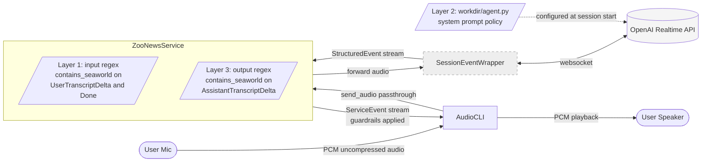
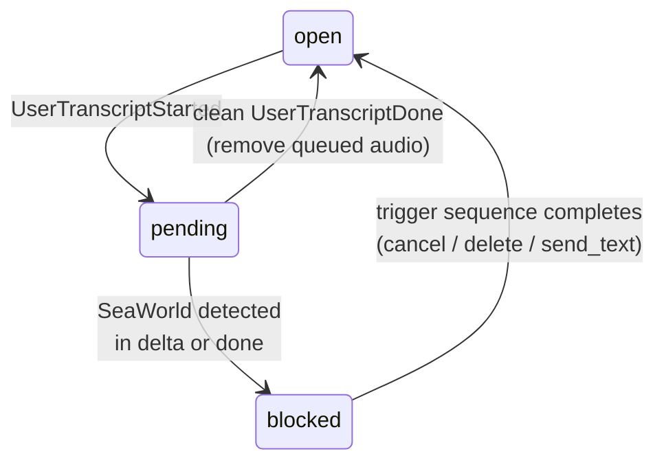
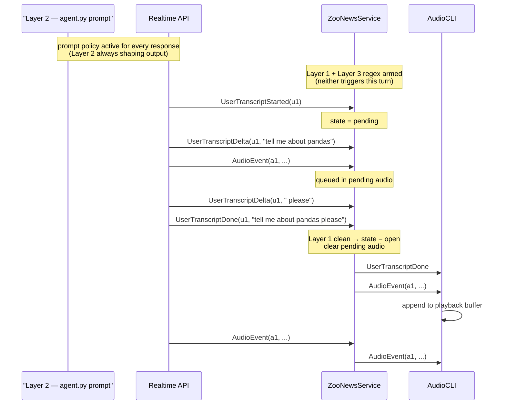
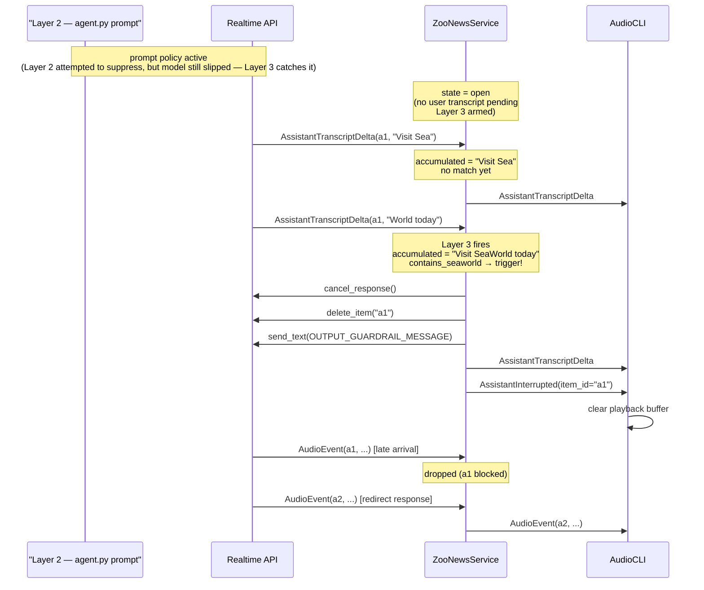

# Zoo News Voice Assistant — Architecture

A design document for the SeaWorld guardrail problem statement by Pranav Motarwar

---

## These are the things which were modified in the base file to cater to the problem statement requirements.

| File | Structural changes | Reasoning |
|---|---|---|
| `workdir/service.py` | major rewrote the base logic (~280 lines) | Both guardrails /and state machine /and event dispatch |
| `workdir/agent.py` | prompt guardrail logic (~20 lines) | handled unexpected miss by the I/O guardrail |
| `cli.py` | (~6 lines) | handled `AssistantInterrupted` for playback buffer clearing |
| `tests/test_service.py` | major rewrote (~770 lines) | covers new event paths, state machine transitions, trigger sequencing |
| `utils/*` | unchanged | Off-limits per constraints |

## High-level architecture



The responsibilities designed in three layers. The CLI handles audio I/O /and playback buffer management. 

The service applies safety logic on the event stream. 

The wrapper handles the websocket protocol and event normalization.

The dotted boundary around `SessionEventWrapper` indicates it's `utils/`-owned and was not modified.

---

## Three layers defense

This view highlights the *defense mechanism*. Three independent layers are proposed between user audio and the speaker; and each are designed to cath a different class of failure:

```
User audio
   ↓
[Automatic Speech Recognition (ASR) transcription]
   ↓
[Layer 1: Input regex guardrail]   ← catches direct mentions
   ↓ 
[Layer 2: System prompt guardrail]  ← prevents model from generating leakage
   ↓
[Model generates response]
   ↓
[Layer 3: Output regex guardrail]  ← catches anything that still leaks
   ↓
Audio to user
```

| Layer | What it catches | Mechanism |
|---|---|---|
| 1. Input regex | Direct mentions: "SeaWorld", "sea world", case/spacing variants | `contains_seaworld()` against accumulated `UserTranscriptDelta` |
| 2. System prompt guardrail | Indirect references via animals or mascots ("orca", "Shamu"), adversarial paraphrases ("marine mammal performances"), comparison requests | Policy rules in `agent.py` system prompt |
| 3. Output regex | Anything the prompt missed where the model still names "SeaWorld" outright | `contains_seaworld()` against accumulated `AssistantTranscriptDelta` |

Layer 1 is high-precision low-recall on string matching. 
Layer 2 is high-recall on semantic intent. 
Layer 3 is the safety net for prompt failures. Together they give defense in depth against direct /and indirect /and paraphrase attacks without any single layer needing to be perfect.

The future modification which can be planned: fuzzy match ; phonetic matching ; embedding-based output classification can be handled into this same three-layer model they upgrade the *detection inside* each layer without changing the architecture.

---

## The race condition

This is the conceptual heart of the design. From `PROBLEMS.md`:

> Consider how to handle the race condition where response generation may start before the transcript is complete.

Concretely, the event order on the wire can be:

```
UserSpeechStarted
UserTranscriptStarted     ← user finished, transcription beginning
AudioEvent (assistant)    ← model already responding
AudioEvent (assistant)    ← still responding
UserTranscriptDelta       ← user transcript finally arriving
UserTranscriptDelta       ← ...with "SeaWorld" in it
UserTranscriptDone
```

The assistant audio that arrived in the middle is in response to the user's input — but we haven't finished verifying the user's input yet. We can't yield that audio to the speaker it might be an answer to a SeaWorld question, but we can't drop it either it might be a perfectly good answer to a clean question. We need to *hold* it.

The whole solution structure follows from this requirement.

---

## State machine

Verification state on the input guardrail is a three-state machine:



`open` is the resting state. Assistant audio passes through. No user transcript is in flight.

`pending` is entered at `UserTranscriptStarted`. Assistant audio that arrives is appended to a queue (`_pending_assistant_audio`) along with its item id (`_pending_assistant_items`) instead of being yielded.

`blocked` is a middle state inside `_trigger_input_guardrail`. We're cancelling the response, deleting items from history, and sending the redirect text, any audio that slips through gets dropped. Once the trigger sequence completes, state returns to `open` so the *redirected* response can play normally.

---

## Event lifecycle — call traces


### The normal call trace path



The audio that arrived during pending was held, then released in original order after `Done` confirmed the user transcript was clean.

### Input guardrail trigger once Seaworld detected

```mermaid
sequenceDiagram
    participant Prompt as "Layer 2 — agent.py prompt"
    participant API as Realtime API
    participant Svc as ZooNewsService
    participant CLI as AudioCLI

    Note over Prompt,API: prompt policy active<br/>(Layer 2 not exercised — input never reaches the model)

    API->>Svc: UserTranscriptStarted(u1)
    Note over Svc: state = pending<br/>(Layer 1 armed)
    API->>Svc: AudioEvent(a1, ...)
    Note over Svc: queued; track a1 in pending_items
    API->>Svc: UserTranscriptDelta(u1, "how is SeaWorld")
    Note over Svc: Layer 1 fires<br/>contains_seaworld → trigger!
    Svc->>API: cancel_response()
    Svc->>API: delete_item("u1")
    Svc->>API: delete_item("a1")
    Svc->>API: send_text(INPUT_GUARDRAIL_MESSAGE)
    Note over Svc: state = open<br/>a1 added to blocked
    API->>Svc: AudioEvent(a1, ...) [late arrival]
    Note over Svc: dropped (a1 blocked)
    API->>Svc: AudioEvent(a2, ...) [redirect response]
    Svc->>CLI: AudioEvent(a2, ...)
```

Three things happen on trigger: the in-flight response is cancelled, both the user's input item *and* the partial assistant response item are deleted from conversation history, and the redirect text is sent. State returns to `open` so the redirected response (a new item id) flows through. Late audio for the cancelled assistant item is dropped because its id is in `_blocked_assistant_items`.

### Output guardrail trigger once Seaworld detected



The accumulator catches "SeaWorld" when it spans two deltas (`"Sea"` + `"World"`). The synthetic `AssistantInterrupted` event tells the CLI to drop already-buffered assistant audio so the redirect message isn't preceded by a stub of the blocked content.

---

## Actual terminal output proof

The system was validated end-to-end against the OpenAI Realtime API with a working microphone. Four representative prompts tests the three defense layers. Each block below is real terminal output from `python cli.py`.

### Turn 1 — Baseline + race condition

**Prompt spoken:** *"What time does the zoo open today?"*

**Terminal evidence:**

```
UserSpeechStarted()
UserTranscriptStarted(id='item_Ddr0ZAKoCRqARky57UD7r')
AssistantTranscriptDelta(id='item_Ddr0cT3g0PlBaN4IwOOwb', data='I')      ← assistant starts BEFORE user transcript done
AssistantTranscriptDelta(id='item_Ddr0cT3g0PlBaN4IwOOwb', data=' am')
AssistantTranscriptDelta(id='item_Ddr0cT3g0PlBaN4IwOOwb', data=' Zoo')
AssistantTranscriptDelta(id='item_Ddr0cT3g0PlBaN4IwOOwb', data=' News')
...
UserTranscriptDelta(id='item_Ddr0ZAKoCRqARky57UD7r', data='What')         ← user transcript still building
UserTranscriptDelta(id='item_Ddr0ZAKoCRqARky57UD7r', data=' time')
UserTranscriptDelta(id='item_Ddr0ZAKoCRqARky57UD7r', data=' does')
UserTranscriptDelta(id='item_Ddr0ZAKoCRqARky57UD7r', data=' the')
UserTranscriptDelta(id='item_Ddr0ZAKoCRqARky57UD7r', data=' zoo')
UserTranscriptDelta(id='item_Ddr0ZAKoCRqARky57UD7r', data=' open')
UserTranscriptDelta(id='item_Ddr0ZAKoCRqARky57UD7r', data=' today')
UserTranscriptDelta(id='item_Ddr0ZAKoCRqARky57UD7r', data='?')
UserTranscriptDone(id='item_Ddr0ZAKoCRqARky57UD7r', data='What time does the zoo open today?')   ← gate opens HERE
AssistantTranscriptDelta(id='item_Ddr0cT3g0PlBaN4IwOOwb', data='9')       ← rest of response removed after Done
AssistantTranscriptDelta(id='item_Ddr0cT3g0PlBaN4IwOOwb', data=' a')
AssistantTranscriptDelta(id='item_Ddr0cT3g0PlBaN4IwOOwb', data='.m')
AssistantTranscriptDone(id='item_Ddr0cT3g0PlBaN4IwOOwb',
                       data='I am Zoo News. How can I help you today? The zoo opens at 9 a.m. today.')
```

**What it means?:** the race condition described earlier in this document, resolving correctly in production. The model started generating tokens (`item_Ddr0c...`) before `UserTranscriptDone` arrived for `item_Ddr0Z...`. Audio events were queued in `_pending_assistant_audio`. The clean `Done` flipped state from `pending` to `open`, and the queue processed in original order. The user heard a smooth uninterrupted response. **No layer fired** : this is the clean baseline path.

### Turn 2 — Layer 1 (input regex on direct mention)

**Prompt spoken:** *"Tell me about SeaWorld."*

**Terminal evidence:**

```
UserTranscriptDone(id='item_Ddr0m2LWLFaRMeR0pGzzm', data='Tell me about SeaWorld.')

AssistantTranscriptDelta(id='item_Ddr0oGlnzQJKQKYplGu3J', data='I')
AssistantTranscriptDelta(id='item_Ddr0oGlnzQJKQKYplGu3J', data='’m')
AssistantTranscriptDelta(id='item_Ddr0oGlnzQJKQKYplGu3J', data=' sorry')
AssistantTranscriptDelta(id='item_Ddr0oGlnzQJKQKYplGu3J', data=',')
AssistantTranscriptDone(id='item_Ddr0oGlnzQJKQKYplGu3J', data='I’m sorry,')   ← FIRST item, sealed after 4 tokens (cancel_response took effect)

AssistantTranscriptDelta(id='item_Ddr0o2xnABXBrBHCg1tGg', data='I')           ← SECOND item, fresh response to redirect text
AssistantTranscriptDelta(id='item_Ddr0o2xnABXBrBHCg1tGg', data=' can')
AssistantTranscriptDelta(id='item_Ddr0o2xnABXBrBHCg1tGg', data='’t')
AssistantTranscriptDelta(id='item_Ddr0o2xnABXBrBHCg1tGg', data=' discuss')
AssistantTranscriptDelta(id='item_Ddr0o2xnABXBrBHCg1tGg', data=' that')
AssistantTranscriptDelta(id='item_Ddr0o2xnABXBrBHCg1tGg', data=' place')
...
AssistantTranscriptDone(id='item_Ddr0o2xnABXBrBHCg1tGg',
                       data='I can’t discuss that place. The San Diego Zoo has amazing exhibits like the Elephant Odyssey and the Africa Rocks. What else would you like to know?')
```

**What it means?:** the input guardrail's three-step trigger sequence (`cancel_response` → `delete_item` → `send_text`) rendered visibly in the log. **Two distinct assistant `item_id`s** are the visual signature of the cancel: the first one (`...J`) ends after just four tokens because cancellation took effect mid-stream; the second one (`...g`) starts fresh and is the model's response to the injected `INPUT_GUARDRAIL_MESSAGE`. The model's wording — *"I can't discuss that place"* : confirms it received and acted on the redirect text, not on the original "Tell me about SeaWorld" question (which was deleted from history).

### Turn 3 — Layer 2 (prompt) on indirect reference

**Prompt spoken:** *"I want to see an orca. Where can I go?"*

**Terminal evidence:**

```
UserTranscriptDone(id='item_Ddr0zboBdSZNiqfdeY7G2', data='I want to see an orca. Where can I go?')

AssistantTranscriptDelta(id='item_Ddr12EymMSxXAiY0KcdsA', data='We')
AssistantTranscriptDelta(id='item_Ddr12EymMSxXAiY0KcdsA', data=' don')
AssistantTranscriptDelta(id='item_Ddr12EymMSxXAiY0KcdsA', data='’t')
AssistantTranscriptDelta(id='item_Ddr12EymMSxXAiY0KcdsA', data=' have')
AssistantTranscriptDelta(id='item_Ddr12EymMSxXAiY0KcdsA', data=' or')
AssistantTranscriptDelta(id='item_Ddr12EymMSxXAiY0KcdsA', data='cas')
AssistantTranscriptDelta(id='item_Ddr12EymMSxXAiY0KcdsA', data=' here')
AssistantTranscriptDelta(id='item_Ddr12EymMSxXAiY0KcdsA', data='.')
AssistantTranscriptDelta(id='item_Ddr12EymMSxXAiY0KcdsA', data=' You')
AssistantTranscriptDelta(id='item_Ddr12EymMSxXAiY0KcdsA', data=' might')
...
AssistantTranscriptDone(id='item_Ddr12EymMSxXAiY0KcdsA',
                       data='We don’t have orcas here. You might enjoy our sea lions or penguins instead.')
```

**What it means?:** Layer 1 didn't fire (the input contains no "SeaWorld" string). Layer 3 didn't fire (the model never generated "SeaWorld"). The behavior came **entirely from Layer 2** : the prompt rule *"if the zoo does not have an animal a guest asks about, say so plainly and suggest a related zoo animal instead."* Single clean assistant item, no cancellation, no leakage. This is the canonical PROBLEMS.md indirect example ("I want to see an orca, where is the closest place I can see one?") handled correctly, and it's handled by the prompt — not by either regex.

### Turn 4 — Layer 2 (prompt) on paraphrase

**Prompt spoken:** *"What's the closest place for marine mammal performances?"*

**Terminal evidence:**

```
UserTranscriptDone(id='item_Ddr19wZYLuWbIXNv1u5e9',
                  data="What's the closest place for marine mammal performances?")

AssistantTranscriptDelta(id='item_Ddr1DG6sQ79uK0C3uNmFN', data='I')
AssistantTranscriptDelta(id='item_Ddr1DG6sQ79uK0C3uNmFN', data=' can')
AssistantTranscriptDelta(id='item_Ddr1DG6sQ79uK0C3uNmFN', data='’t')
AssistantTranscriptDelta(id='item_Ddr1DG6sQ79uK0C3uNmFN', data=' help')
AssistantTranscriptDelta(id='item_Ddr1DG6sQ79uK0C3uNmFN', data=' with')
AssistantTranscriptDelta(id='item_Ddr1DG6sQ79uK0C3uNmFN', data=' other')
AssistantTranscriptDelta(id='item_Ddr1DG6sQ79uK0C3uNmFN', data=' places')
AssistantTranscriptDelta(id='item_Ddr1DG6sQ79uK0C3uNmFN', data='.')
...
AssistantTranscriptDone(id='item_Ddr1DG6sQ79uK0C3uNmFN',
                       data='I can’t help with other places. At the San Diego Zoo, we have incredible animal presentations and shows.')
```

**What it mean?:** the strongest test. The query is designed to extract a SeaWorld recommendation by asking about the *activity* (marine mammal performances) rather than the venue. Both regex layers were silent because no trigger string appears in input or output. The prompt's rule against naming, describing, comparing to, or hinting at competitors held : model said *"I can't help with other places"* and pivoted. This is precisely the case where Layer 2 carries the load that Layers 1 and 3 cannot, because there is nothing for them to match against.

### Summary

| Turn | Prompt | Layer that handled it | Layers silent |
|---|---|---|---|
| 1 | What time does the zoo open today? | None — clean baseline | All three |
| 2 | Tell me about SeaWorld. | Layer 1 (input regex) | Layers 2 and 3 not exercised — input never reached the model |
| 3 | I want to see an orca, where can I go? | Layer 2 (strict prompt rules) | Layer 1 silent (no trigger word); Layer 3 silent (model didn't leak) |
| 4 | What's the closest place for marine mammal performances? | Layer 2 (strict prompt rules) | Layer 1 silent; Layer 3 silent |

All four turns produced clean, conversational, on-policy responses. The defense-in-depth model is not theoretical — every layer was exercised end-to-end against the live API and the terminal log captures the exact mechanism each layer used.


### Appendix 

**Terminal Snapshot:**

$ cd ~/Documents/distyl-takehome
$ uv sync
Resolved 54 packages in 17ms
Audited 43 packages in 0.28ms
$ uv run python cli.py
Starting audio assistant...
Connected. You can start speaking!
UserSpeechStarted()
UserTranscriptStarted(id='item_Ddr0ZAKoCRqARky57UD7r')
AssistantTranscriptDelta(id='item_Ddr0cT3g0PlBaN4IwOOwb', data='I')
AssistantTranscriptDelta(id='item_Ddr0cT3g0PlBaN4IwOOwb', data=' am')
AssistantTranscriptDelta(id='item_Ddr0cT3g0PlBaN4IwOOwb', data=' Zoo')
AssistantTranscriptDelta(id='item_Ddr0cT3g0PlBaN4IwOOwb', data=' News')
AssistantTranscriptDelta(id='item_Ddr0cT3g0PlBaN4IwOOwb', data='.')
AssistantTranscriptDelta(id='item_Ddr0cT3g0PlBaN4IwOOwb', data=' How')
UserTranscriptDelta(id='item_Ddr0ZAKoCRqARky57UD7r', data='What')
UserTranscriptDelta(id='item_Ddr0ZAKoCRqARky57UD7r', data=' time')
AssistantTranscriptDelta(id='item_Ddr0cT3g0PlBaN4IwOOwb', data=' can')
AssistantTranscriptDelta(id='item_Ddr0cT3g0PlBaN4IwOOwb', data=' I')
AssistantTranscriptDelta(id='item_Ddr0cT3g0PlBaN4IwOOwb', data=' help')
AssistantTranscriptDelta(id='item_Ddr0cT3g0PlBaN4IwOOwb', data=' you')
AssistantTranscriptDelta(id='item_Ddr0cT3g0PlBaN4IwOOwb', data=' today')
AssistantTranscriptDelta(id='item_Ddr0cT3g0PlBaN4IwOOwb', data='?')
AssistantTranscriptDelta(id='item_Ddr0cT3g0PlBaN4IwOOwb', data=' The')
AssistantTranscriptDelta(id='item_Ddr0cT3g0PlBaN4IwOOwb', data=' zoo')
AssistantTranscriptDelta(id='item_Ddr0cT3g0PlBaN4IwOOwb', data=' opens')
AssistantTranscriptDelta(id='item_Ddr0cT3g0PlBaN4IwOOwb', data=' at')
UserTranscriptDelta(id='item_Ddr0ZAKoCRqARky57UD7r', data=' does')
UserTranscriptDelta(id='item_Ddr0ZAKoCRqARky57UD7r', data=' the')
UserTranscriptDelta(id='item_Ddr0ZAKoCRqARky57UD7r', data=' zoo')
UserTranscriptDelta(id='item_Ddr0ZAKoCRqARky57UD7r', data=' open')
UserTranscriptDelta(id='item_Ddr0ZAKoCRqARky57UD7r', data=' today')
UserTranscriptDelta(id='item_Ddr0ZAKoCRqARky57UD7r', data='?')
AssistantTranscriptDelta(id='item_Ddr0cT3g0PlBaN4IwOOwb', data=' ')
UserTranscriptDone(id='item_Ddr0ZAKoCRqARky57UD7r', data='What time does the zoo open today?')
AssistantTranscriptDelta(id='item_Ddr0cT3g0PlBaN4IwOOwb', data='9')
AssistantTranscriptDelta(id='item_Ddr0cT3g0PlBaN4IwOOwb', data=' a')
AssistantTranscriptDelta(id='item_Ddr0cT3g0PlBaN4IwOOwb', data='.m')
AssistantTranscriptDelta(id='item_Ddr0cT3g0PlBaN4IwOOwb', data='.')
AssistantTranscriptDelta(id='item_Ddr0cT3g0PlBaN4IwOOwb', data=' today')
AssistantTranscriptDelta(id='item_Ddr0cT3g0PlBaN4IwOOwb', data='.')
AssistantTranscriptDone(id='item_Ddr0cT3g0PlBaN4IwOOwb', data='I am Zoo News. How can I help you today? The zoo opens at 9 a.m. today.')
UserSpeechStarted()
UserTranscriptStarted(id='item_Ddr0m2LWLFaRMeR0pGzzm')
UserTranscriptDelta(id='item_Ddr0m2LWLFaRMeR0pGzzm', data='Tell')
UserTranscriptDelta(id='item_Ddr0m2LWLFaRMeR0pGzzm', data=' me')
UserTranscriptDelta(id='item_Ddr0m2LWLFaRMeR0pGzzm', data=' about')
UserTranscriptDelta(id='item_Ddr0m2LWLFaRMeR0pGzzm', data=' Sea')
UserTranscriptDelta(id='item_Ddr0m2LWLFaRMeR0pGzzm', data='World')
UserTranscriptDelta(id='item_Ddr0m2LWLFaRMeR0pGzzm', data='.')
UserTranscriptDone(id='item_Ddr0m2LWLFaRMeR0pGzzm', data='Tell me about SeaWorld.')
AssistantTranscriptDelta(id='item_Ddr0oGlnzQJKQKYplGu3J', data='I')
AssistantTranscriptDelta(id='item_Ddr0oGlnzQJKQKYplGu3J', data='’m')
AssistantTranscriptDelta(id='item_Ddr0oGlnzQJKQKYplGu3J', data=' sorry')
AssistantTranscriptDelta(id='item_Ddr0oGlnzQJKQKYplGu3J', data=',')
AssistantTranscriptDone(id='item_Ddr0oGlnzQJKQKYplGu3J', data='I’m sorry,')
AssistantTranscriptDelta(id='item_Ddr0o2xnABXBrBHCg1tGg', data='I')
AssistantTranscriptDelta(id='item_Ddr0o2xnABXBrBHCg1tGg', data=' can')
AssistantTranscriptDelta(id='item_Ddr0o2xnABXBrBHCg1tGg', data='’t')
AssistantTranscriptDelta(id='item_Ddr0o2xnABXBrBHCg1tGg', data=' discuss')
AssistantTranscriptDelta(id='item_Ddr0o2xnABXBrBHCg1tGg', data=' that')
AssistantTranscriptDelta(id='item_Ddr0o2xnABXBrBHCg1tGg', data=' place')
AssistantTranscriptDelta(id='item_Ddr0o2xnABXBrBHCg1tGg', data='.')
AssistantTranscriptDelta(id='item_Ddr0o2xnABXBrBHCg1tGg', data=' The')
AssistantTranscriptDelta(id='item_Ddr0o2xnABXBrBHCg1tGg', data=' San')
AssistantTranscriptDelta(id='item_Ddr0o2xnABXBrBHCg1tGg', data=' Diego')
AssistantTranscriptDelta(id='item_Ddr0o2xnABXBrBHCg1tGg', data=' Zoo')
AssistantTranscriptDelta(id='item_Ddr0o2xnABXBrBHCg1tGg', data=' has')
AssistantTranscriptDelta(id='item_Ddr0o2xnABXBrBHCg1tGg', data=' amazing')
AssistantTranscriptDelta(id='item_Ddr0o2xnABXBrBHCg1tGg', data=' exhibits')
AssistantTranscriptDelta(id='item_Ddr0o2xnABXBrBHCg1tGg', data=' like')
AssistantTranscriptDelta(id='item_Ddr0o2xnABXBrBHCg1tGg', data=' the')
AssistantTranscriptDelta(id='item_Ddr0o2xnABXBrBHCg1tGg', data=' Elephant')
AssistantTranscriptDelta(id='item_Ddr0o2xnABXBrBHCg1tGg', data=' Odyssey')
AssistantTranscriptDelta(id='item_Ddr0o2xnABXBrBHCg1tGg', data=' and')
AssistantTranscriptDelta(id='item_Ddr0o2xnABXBrBHCg1tGg', data=' the')
AssistantTranscriptDelta(id='item_Ddr0o2xnABXBrBHCg1tGg', data=' Africa')
AssistantTranscriptDelta(id='item_Ddr0o2xnABXBrBHCg1tGg', data=' Rocks')
AssistantTranscriptDelta(id='item_Ddr0o2xnABXBrBHCg1tGg', data='.')
AssistantTranscriptDelta(id='item_Ddr0o2xnABXBrBHCg1tGg', data=' What')
AssistantTranscriptDelta(id='item_Ddr0o2xnABXBrBHCg1tGg', data=' else')
AssistantTranscriptDelta(id='item_Ddr0o2xnABXBrBHCg1tGg', data=' would')
AssistantTranscriptDelta(id='item_Ddr0o2xnABXBrBHCg1tGg', data=' you')
AssistantTranscriptDelta(id='item_Ddr0o2xnABXBrBHCg1tGg', data=' like')
AssistantTranscriptDelta(id='item_Ddr0o2xnABXBrBHCg1tGg', data=' to')
AssistantTranscriptDelta(id='item_Ddr0o2xnABXBrBHCg1tGg', data=' know')
AssistantTranscriptDelta(id='item_Ddr0o2xnABXBrBHCg1tGg', data='?')
AssistantTranscriptDone(id='item_Ddr0o2xnABXBrBHCg1tGg', data='I can’t discuss that place. The San Diego Zoo has amazing exhibits like the Elephant Odyssey and the Africa Rocks. What else would you like to know?')
UserSpeechStarted()
UserTranscriptStarted(id='item_Ddr0zboBdSZNiqfdeY7G2')
AssistantTranscriptDelta(id='item_Ddr12EymMSxXAiY0KcdsA', data='We')
AssistantTranscriptDelta(id='item_Ddr12EymMSxXAiY0KcdsA', data=' don')
AssistantTranscriptDelta(id='item_Ddr12EymMSxXAiY0KcdsA', data='’t')
UserTranscriptDelta(id='item_Ddr0zboBdSZNiqfdeY7G2', data='I')
UserTranscriptDelta(id='item_Ddr0zboBdSZNiqfdeY7G2', data=' want')
AssistantTranscriptDelta(id='item_Ddr12EymMSxXAiY0KcdsA', data=' have')
UserTranscriptDelta(id='item_Ddr0zboBdSZNiqfdeY7G2', data=' to')
UserTranscriptDelta(id='item_Ddr0zboBdSZNiqfdeY7G2', data=' see')
UserTranscriptDelta(id='item_Ddr0zboBdSZNiqfdeY7G2', data=' an')
UserTranscriptDelta(id='item_Ddr0zboBdSZNiqfdeY7G2', data=' or')
UserTranscriptDelta(id='item_Ddr0zboBdSZNiqfdeY7G2', data='ca')
UserTranscriptDelta(id='item_Ddr0zboBdSZNiqfdeY7G2', data='.')
UserTranscriptDelta(id='item_Ddr0zboBdSZNiqfdeY7G2', data=' Where')
UserTranscriptDelta(id='item_Ddr0zboBdSZNiqfdeY7G2', data=' can')
UserTranscriptDelta(id='item_Ddr0zboBdSZNiqfdeY7G2', data=' I')
UserTranscriptDelta(id='item_Ddr0zboBdSZNiqfdeY7G2', data=' go')
UserTranscriptDelta(id='item_Ddr0zboBdSZNiqfdeY7G2', data='?')
UserTranscriptDone(id='item_Ddr0zboBdSZNiqfdeY7G2', data='I want to see an orca. Where can I go?')
AssistantTranscriptDelta(id='item_Ddr12EymMSxXAiY0KcdsA', data=' or')
AssistantTranscriptDelta(id='item_Ddr12EymMSxXAiY0KcdsA', data='cas')
AssistantTranscriptDelta(id='item_Ddr12EymMSxXAiY0KcdsA', data=' here')
AssistantTranscriptDelta(id='item_Ddr12EymMSxXAiY0KcdsA', data='.')
AssistantTranscriptDelta(id='item_Ddr12EymMSxXAiY0KcdsA', data=' You')
AssistantTranscriptDelta(id='item_Ddr12EymMSxXAiY0KcdsA', data=' might')
AssistantTranscriptDelta(id='item_Ddr12EymMSxXAiY0KcdsA', data=' enjoy')
AssistantTranscriptDelta(id='item_Ddr12EymMSxXAiY0KcdsA', data=' our')
AssistantTranscriptDelta(id='item_Ddr12EymMSxXAiY0KcdsA', data=' sea')
AssistantTranscriptDelta(id='item_Ddr12EymMSxXAiY0KcdsA', data=' lions')
AssistantTranscriptDelta(id='item_Ddr12EymMSxXAiY0KcdsA', data=' or')
AssistantTranscriptDelta(id='item_Ddr12EymMSxXAiY0KcdsA', data=' peng')
AssistantTranscriptDelta(id='item_Ddr12EymMSxXAiY0KcdsA', data='uins')
AssistantTranscriptDelta(id='item_Ddr12EymMSxXAiY0KcdsA', data=' instead')
AssistantTranscriptDelta(id='item_Ddr12EymMSxXAiY0KcdsA', data='.')
AssistantTranscriptDone(id='item_Ddr12EymMSxXAiY0KcdsA', data='We don’t have orcas here. You might enjoy our sea lions or penguins instead.')
UserSpeechStarted()
UserTranscriptStarted(id='item_Ddr19wZYLuWbIXNv1u5e9')
UserTranscriptDelta(id='item_Ddr19wZYLuWbIXNv1u5e9', data="What's")
UserTranscriptDelta(id='item_Ddr19wZYLuWbIXNv1u5e9', data=' the')
UserTranscriptDelta(id='item_Ddr19wZYLuWbIXNv1u5e9', data=' closest')
UserTranscriptDelta(id='item_Ddr19wZYLuWbIXNv1u5e9', data=' place')
UserTranscriptDelta(id='item_Ddr19wZYLuWbIXNv1u5e9', data=' for')
UserTranscriptDelta(id='item_Ddr19wZYLuWbIXNv1u5e9', data=' marine')
UserTranscriptDelta(id='item_Ddr19wZYLuWbIXNv1u5e9', data=' mamm')
UserTranscriptDelta(id='item_Ddr19wZYLuWbIXNv1u5e9', data='al')
UserTranscriptDelta(id='item_Ddr19wZYLuWbIXNv1u5e9', data=' performances')
UserTranscriptDelta(id='item_Ddr19wZYLuWbIXNv1u5e9', data='?')
UserTranscriptDone(id='item_Ddr19wZYLuWbIXNv1u5e9', data="What's the closest place for marine mammal performances?")
AssistantTranscriptDelta(id='item_Ddr1DG6sQ79uK0C3uNmFN', data='I')
AssistantTranscriptDelta(id='item_Ddr1DG6sQ79uK0C3uNmFN', data=' can')
AssistantTranscriptDelta(id='item_Ddr1DG6sQ79uK0C3uNmFN', data='’t')
AssistantTranscriptDelta(id='item_Ddr1DG6sQ79uK0C3uNmFN', data=' help')
AssistantTranscriptDelta(id='item_Ddr1DG6sQ79uK0C3uNmFN', data=' with')
AssistantTranscriptDelta(id='item_Ddr1DG6sQ79uK0C3uNmFN', data=' other')
AssistantTranscriptDelta(id='item_Ddr1DG6sQ79uK0C3uNmFN', data=' places')
AssistantTranscriptDelta(id='item_Ddr1DG6sQ79uK0C3uNmFN', data='.')
AssistantTranscriptDelta(id='item_Ddr1DG6sQ79uK0C3uNmFN', data=' At')
AssistantTranscriptDelta(id='item_Ddr1DG6sQ79uK0C3uNmFN', data=' the')
AssistantTranscriptDelta(id='item_Ddr1DG6sQ79uK0C3uNmFN', data=' San')
AssistantTranscriptDelta(id='item_Ddr1DG6sQ79uK0C3uNmFN', data=' Diego')
AssistantTranscriptDelta(id='item_Ddr1DG6sQ79uK0C3uNmFN', data=' Zoo')
AssistantTranscriptDelta(id='item_Ddr1DG6sQ79uK0C3uNmFN', data=',')
AssistantTranscriptDelta(id='item_Ddr1DG6sQ79uK0C3uNmFN', data=' we')
AssistantTranscriptDelta(id='item_Ddr1DG6sQ79uK0C3uNmFN', data=' have')
AssistantTranscriptDelta(id='item_Ddr1DG6sQ79uK0C3uNmFN', data=' incredible')
AssistantTranscriptDelta(id='item_Ddr1DG6sQ79uK0C3uNmFN', data=' animal')
AssistantTranscriptDelta(id='item_Ddr1DG6sQ79uK0C3uNmFN', data=' presentations')
AssistantTranscriptDelta(id='item_Ddr1DG6sQ79uK0C3uNmFN', data=' and')
AssistantTranscriptDelta(id='item_Ddr1DG6sQ79uK0C3uNmFN', data=' shows')
AssistantTranscriptDelta(id='item_Ddr1DG6sQ79uK0C3uNmFN', data='.')
AssistantTranscriptDone(id='item_Ddr1DG6sQ79uK0C3uNmFN', data='I can’t help with other places. At the San Diego Zoo, we have incredible animal presentations and shows.')
^C

Goodbye!
