# AI Use Case Design — From Problem to v1 / v2 / v3

> Companion to `SYSTEM_DESIGN_PREP.md`. That doc taught you the **fundamentals**. This doc teaches you to **decide**: given a problem, what do you build first (v1), what do you add when v1 plateaus (v2), what do you add to make it production-grade (v3) — and how to justify every component (LLM, chunking, retrieval, tools, MCP, memory, evaluation, validation).

---

## How to use this document

You will be asked an open-ended design question. You have ~5 minutes to commit to a v1, ~5 minutes to evolve to v2, and ~5 minutes to discuss v3 + validation + edge cases. This doc gives you:

1. **Part 1 — Decision Framework.** How to choose between LLM-only / RAG / Agent in the first 60 seconds.
2. **Part 2 — Full Stack Components.** Every component you might mention (LLM, chunking, embeddings, vector DB, retrieval, tools, MCP, memory, caching, streaming, validation, eval, monitoring). For each: when to use, how to pick, concrete numbers, common pitfalls.
3. **Part 3 — 10 Worked Use Cases.** Each shows v1 → v2 → v3 with every component justified by a concrete failure mode v(N-1) hit.
4. **Part 4 — Validation Playbook.** Offline → shadow → A/B → production monitoring → compliance. The full pipeline.
5. **Part 5 — Interview Choreography.** How to deliver a use-case answer in 15 minutes without rambling.

**The single principle**: at every version, every component must be justified by a *concrete failure mode of the previous version*. If you can't name the failure mode v1 had that v2 fixes, don't add the component.

---

# Part 1 — The Decision Framework

## 1.1 The three things an LLM cannot do alone

A modern LLM (Claude, GPT, Gemini, Llama) is extraordinarily capable. Before reaching for RAG or agents, ask: **what does the LLM not know, and what can it not do?**

Three failure modes drive every architecture choice:

| Failure mode | What's missing | Solution |
|---|---|---|
| LLM doesn't know your private data | Access to your docs, DBs, systems | **RAG** (retrieve relevant context) |
| LLM doesn't know fresh data | Today's news, current account state, latest deploys | **RAG** or **Tools** (fetch on demand) |
| LLM can't take actions in the world | Send email, write to DB, run code, call APIs | **Agent + Tools** |

If none of these three apply, **build with just the LLM**. Most candidates over-architect. The best interview signal is restraint — "I'd start with just an LLM call, and here's how I'd measure when that breaks."

## 1.2 The decision tree

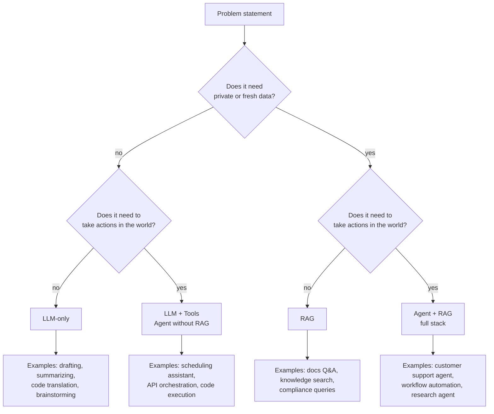

**Read the leaves:**
- *LLM-only*: prompt engineering, few-shot, output formatting, prompt caching. Cheapest, fastest.
- *LLM + Tools*: function calling for side effects, no retrieval needed.
- *RAG*: retrieval over your corpus, generation grounded in retrieved context.
- *Agent + RAG*: the LLM plans, retrieves on demand, calls tools, loops.

## 1.3 Anti-patterns to avoid

**Anti-pattern 1: Reaching for RAG when prompt + few-shot would do.** If your corpus fits in 50K tokens, just put it in the prompt with prompt caching. RAG adds operational complexity (embedding pipeline, vector DB, retrieval tuning, chunking decisions) that isn't worth it for small corpora.

**Anti-pattern 2: Reaching for an agent when a chain would do.** If your steps are fixed (parse → retrieve → generate → validate), write a deterministic chain. Agents are for *branching* and *unknown step counts*. An agent that always does the same 3 steps is a chain with extra latency and cost.

**Anti-pattern 3: Multi-agent when single-agent + good tools would do.** Multi-agent systems compound failure modes. Use them only when you have genuinely different *roles* with different prompts/models/tools and a clear coordination protocol.

**Anti-pattern 4: Skipping v1 and proposing v3 first.** "We'd build a multi-agent system with planner, retriever, executor, critic" before defining the problem. Interviewers want to see you ship the smallest valuable thing first.

## 1.4 The v1 → v2 → v3 evolution

The discipline:

| Version | Goal | Timeline | Posture |
|---|---|---|---|
| v1 | Prove the use case is solvable. Demo-able. | 1–2 weeks | Maximum simplicity. One LLM call if possible. Hardcode what you can. |
| v2 | Address the top 2 failure modes from v1. | 1–2 months | Targeted additions — RAG, one tool, eval set. No premature optimization. |
| v3 | Scale, polish, production-grade. | 3–6 months | Multi-region, caching, advanced retrieval, full eval pipeline, monitoring, guardrails. |

**The interview rule**: when proposing v2, name the specific v1 failure mode that justifies it. When proposing v3, name the specific v2 failure mode (or scale/safety/compliance gap) that justifies it. This proves you reason from data, not buzzwords.

## 1.5 First-60-seconds clarifying questions (memorize)

Before committing to LLM / RAG / Agent, ask these three:

1. **"What's the data the answer should be grounded in — is it public, private, or doesn't matter?"**
   → drives RAG decision
2. **"Does the system need to *do* anything beyond producing text — write to a system, send a message, run code?"**
   → drives Agent decision
3. **"What's the latency budget and the daily volume?"**
   → drives model choice, caching, infra

After these three answers, you can commit to v1 with confidence.

---

# Part 2 — Full Stack Components

For every component below: **what it is**, **when you need it**, **how to pick**, **concrete numbers**, **common pitfalls**.

## 2.1 LLM Choice

### What it is
The core model. Closed (Claude Sonnet 4.5 / Opus, GPT-5 / 4o, Gemini 2.5 Pro) or open (Llama 3.1 70B/405B, Qwen 2.5 72B, Mistral Large, DeepSeek V3).

### When you need to think about it
Every project. The LLM is the single biggest cost and quality lever.

### How to pick

| Use case characteristic | Lean toward | Reason |
|---|---|---|
| High volume, low complexity (FAQ, classification) | Small closed (Haiku, GPT-4o-mini) or small open (Llama-8B, Qwen-7B) | Cost dominates |
| Reasoning-heavy (multi-hop, code, math) | Large closed (Opus, GPT-5, Gemini 2.5 Pro) | Quality dominates |
| Strict data residency / on-prem | Open-weights served via vLLM/TGI | No data egress |
| Fine-tuning required | Open-weights (Llama, Qwen) or closed FT (OpenAI, Gemini) | Lock-in vs control |
| Function calling + structured output critical | Claude, GPT-4o/5, Gemini — all strong | All three are well-tested |
| Long context (>200K tokens) | Claude (200K), Gemini (1M-2M), GPT-4.1 (1M) | Native support |

### Per-task model routing (a v2+ move)
Don't use one model for everything. Route by task complexity:
- Cheap classifier model decides the task type (or just regex/rules)
- Simple lookups → small model (Haiku, GPT-4o-mini, ~$0.25/1M input tokens)
- Complex reasoning → large model (Sonnet/Opus/GPT-5, ~$3-15/1M input tokens)
- Cost reduction: 60–80% in practice with no quality regression on simple queries.

### Numbers to memorize (2025 ballpark)

| Model class | Input $/1M tok | Output $/1M tok | TPM (typ) | TTFT |
|---|---|---|---|---|
| Haiku-class / GPT-4o-mini | $0.25 – $1 | $1 – $5 | ~150 | ~300ms |
| Sonnet-class / GPT-4o | $3 – $5 | $15 – $25 | ~80 | ~500ms |
| Opus-class / GPT-5 | $15 – $20 | $60 – $80 | ~40 | ~700ms |
| Open 7-8B (self-host) | ~$0.05 (compute) | same | 100+ | ~200ms |
| Open 70B (self-host) | ~$0.50 (compute) | same | ~40 | ~500ms |

### Common pitfalls
- Defaulting to the biggest model "to be safe" — cost explodes at scale.
- Defaulting to open-weights "for control" without budgeting the GPU + ops cost (often 3–5× higher TCO at <10M tokens/day).
- Picking based on benchmark scores instead of *your* eval set.

## 2.2 Prompting & Prompt Engineering

### What it is
The text and structure you send to the LLM. The cheapest, fastest lever you have. **Every project starts here.**

### Components of a production prompt
1. **System prompt** — role, constraints, output format, refusal policy.
2. **Context** — retrieved chunks (if RAG), conversation history, tool definitions (if agent).
3. **Few-shot examples** — 2–5 input/output pairs for tricky tasks.
4. **Instructions** — what to do, what not to do, output schema.
5. **The user message** — the actual query.

### Order matters (for prompt caching)
Put **stable content first** (system prompt, tool definitions, few-shot examples), **dynamic content last** (retrieved context, user query). Anthropic and OpenAI both cache by *prefix*. If your stable prefix is 10K tokens, you save 90% on input cost for every request that reuses it.

### Output formatting
- **JSON mode / strict structured output** — both Anthropic and OpenAI support strict schemas. Use this for any structured task. It eliminates "almost-JSON" parse errors.
- **XML tags for in-prompt structure** — Anthropic's models are especially strong with `<context>...</context>`, `<task>...</task>`, `<rules>...</rules>` separators.
- **Explicit "respond with exactly:" templates** — when you need a fixed shape.

### Chain-of-thought (CoT)
- Old: "Let's think step by step."
- New: structured CoT in a `<reasoning>` block, then the actual answer in `<answer>`. You can later choose to surface or strip the reasoning.
- For models with built-in extended thinking (Claude, o1, DeepSeek R1), let the model think and just consume the answer.

### Few-shot
Use when:
- The output format is unusual.
- The task has implicit conventions you can't easily describe.
- You need consistent style.
Don't use when:
- The task is simple and the model gets it from instructions alone.
- The few-shots are stale or inconsistent.

### Numbers to drop
- Prompt caching: Anthropic ~10% read cost on hit (90% savings), OpenAI ~50% on hit. Cache TTL ~5 min default.
- Few-shot overhead: each example typically 200–600 tokens. Cache them.
- A well-structured prompt rarely exceeds 3–8K tokens for the static portion.

### Common pitfalls
- Putting the user query *before* the instructions (LLM tends to follow whatever came last).
- Inconsistent few-shot examples (model picks up the inconsistency).
- Long system prompts that bury the actual instruction (recency + primacy bias).
- Not version-controlling prompts (you can't diff a regression).

## 2.3 Context Management

### What it is
Deciding what goes into the context window for any given turn. Becomes critical when conversations grow or contexts are huge.

### Three strategies
1. **Sliding window** — keep last N turns. Simple, lossy. Default for short conversations.
2. **Rolling summary** — every N turns, summarize old turns into a paragraph and replace them. Common above ~10 turns or ~20K tokens of history.
3. **Hierarchical / multi-level summary** — turn summaries → session summaries → long-term memory. Used for agents with weeks-long context.

### Token math
- Claude Sonnet 4.5: 200K context. A 200-page PDF ≈ 80K tokens. Use long context only when retrieval can't beat it.
- Gemini 2.5 Pro: 1M-2M context. Useful for whole-codebase queries.
- Cost of long context: 200K input @ $3/1M = $0.60 per call. Compounds fast.

### When long-context beats RAG
- The corpus is small enough to fit.
- You need cross-document synthesis that retrieval misses.
- You only run a few queries (cost stays low).

### When RAG beats long-context
- Corpus exceeds context window.
- You run many queries (per-query cost matters).
- You need citations (the LLM tells you *which* doc).
- Latency matters (smaller inputs prefill faster).

### Common pitfalls
- Naively stuffing every doc into context "just in case" — quality degrades past ~50K tokens (needle-in-haystack regressions documented in many papers).
- Truncating mid-message (breaks tool calls, breaks JSON).
- Not measuring context size in production (silent cost balloon).

## 2.4 Chunking (RAG path)

### What it is
Splitting source documents into retrieval units. The single biggest determinant of retrieval quality. **Bad chunks → bad RAG, period.**

### Strategies (pick one or compose)

| Strategy | When to use | Cost |
|---|---|---|
| Fixed-size (e.g., 500 tokens) | Quick baseline, homogeneous text | Lowest |
| Recursive character splitter | General-purpose default; respects paragraphs, sentences | Low |
| Sentence / token boundary | Short, well-formed text | Low |
| Structural (Markdown / heading-aware) | Docs with clear hierarchy (Confluence, technical docs) | Medium |
| Semantic chunking | When topic shifts within a document matter | Higher (extra embedding step) |
| Hierarchical (parent-child) | Legal, scientific, long-form | Medium |
| AST-based | Code | Medium |
| Layout-aware (Unstructured, Azure DI, Textract) | PDFs with tables, columns, figures | High |

### The knobs

| Knob | Typical range | Effect |
|---|---|---|
| Chunk size | 200 – 800 tokens | Smaller = more precise retrieval, less context for LLM. Larger = noisier retrieval, more context. |
| Overlap | 10 – 20% of chunk size | Higher = better at clause boundaries, more storage, more retrievals of near-duplicates. |
| Parent expansion | Off / 1x / 2x | After retrieving a chunk, fetch its parent (full section). Boosts answer quality without retraining retrieval. |

### Decision in 30 seconds
- Default: **400-token chunks, 50-token overlap, recursive splitter.**
- Add structural awareness if the docs have clear headings.
- Add parent-child if the LLM can't answer with just retrieved chunks.

### Special cases
- **Code**: split by function/class using AST (tree-sitter). Never split mid-function.
- **Tables**: extract as separate chunks; serialize as markdown or HTML with column headers preserved.
- **Images / charts**: caption with vision LLM at ingest; store caption as chunk text + keep image reference in metadata.
- **Conversations / chat logs**: chunk by topic, not by turn count.

### Common pitfalls
- Fixed-size on legal/scientific docs (breaks at clauses, citations).
- Forgetting to chunk tables differently (you'll embed "| col1 | col2 |" and retrieval will be confused).
- Re-chunking on every model change (expensive; chunks should outlive embedding model swaps).
- Not storing chunk metadata (doc_id, section_id, page) — destroys your ability to cite.

## 2.5 Embeddings (RAG path)

### What it is
A model that maps text to a fixed-dimensional vector. Semantic similarity ≈ vector cosine similarity.

### Choices (2025)

| Model | Provider | Dim | Cost/1M tok | Notes |
|---|---|---|---|---|
| text-embedding-3-small | OpenAI | 1536 (Matryoshka) | $0.02 | Strong default |
| text-embedding-3-large | OpenAI | 3072 (Matryoshka) | $0.13 | Highest closed quality |
| voyage-3 / voyage-3-large | Voyage AI | 1024 / 1024 | $0.06 / $0.18 | SOTA on MTEB recently |
| Cohere embed-v3 | Cohere | 1024 | $0.10 | Strong multilingual |
| bge-large-en, bge-m3 | BAAI (open) | 1024 | self-host | Strong, free |
| e5-mistral-7b-instruct | Microsoft (open) | 4096 | self-host | Top of MTEB |
| Snowflake arctic-embed | Snowflake (open) | 1024 | self-host | Strong on enterprise text |

### How to pick
1. **Start with text-embedding-3-small.** Cheap, strong, low-friction.
2. Swap to bge or e5-mistral if you have GPUs and want zero per-query cost.
3. Voyage for domain-specific (legal, code).
4. Multilingual: bge-m3 or Cohere embed-v3.

### Matryoshka embeddings (modern feature)
Truncate to fewer dimensions (e.g., 256 from 1536) for storage savings. Quality drops gracefully. Use this to fit more vectors in RAM.

### Numbers to drop
- Embedding latency: ~30–80ms per batch of 10 chunks (closed APIs); ~10ms self-hosted.
- Storage: 1M chunks × 1024 dim × float16 = ~2GB. Half if you compress to int8.
- Re-embedding cost: 10M chunks × text-embedding-3-small = $20. Easy to redo when models improve.

### Common pitfalls
- Mixing embedding models in one index (different vector spaces — broken retrieval).
- Not re-embedding queries with the same model used for documents.
- Choosing a model based on MTEB without testing on *your* domain.

## 2.6 Vector Database (RAG path)

### What it is
Storage + indexing for embeddings + fast approximate nearest neighbor (ANN) search.

### Choices

| DB | Hosted | Open | Best for |
|---|---|---|---|
| pgvector | self / managed | yes | Already have Postgres; small/medium scale; transactional consistency |
| Pinecone | yes | no | Managed; multi-tenant SaaS; fast time to prod |
| Weaviate | both | yes | Hybrid out of the box, modular |
| Qdrant | both | yes | Modern Rust, fast, strong filtering |
| Milvus | both | yes | Very large scale (billions of vectors) |
| OpenSearch / Elasticsearch | both | yes | Already have it; hybrid built-in |
| Vespa | both | yes | Most flexible, hardest to operate |
| LanceDB / Chroma | self | yes | Local / embedded dev |

### Decision in 30 seconds
- Default: **pgvector** if you already have Postgres and <10M vectors.
- Managed at SaaS scale: **Pinecone** or **Qdrant Cloud**.
- Billions of vectors: **Milvus** or **Vespa**.
- Hybrid (BM25 + dense): **OpenSearch** or **Weaviate**.

### Index types
| Type | Trade-off |
|---|---|
| Flat | Exact, slow, ~OK to ~1M vectors |
| IVF | Fast, recall depends on `nprobe` |
| HNSW | Strong default. Fast, high recall. Higher memory. |
| DiskANN | Disk-resident, billions of vectors, slower than HNSW |

### HNSW knobs
- `M` (graph connectivity): 16–64. Higher = better recall, more memory.
- `ef_construction`: 100–400. Build-time only. Higher = better index quality.
- `ef_search`: 50–500. Query-time. Higher = better recall, slower queries.

### Filters
Metadata filters (`tenant_id`, `doc_id`, `created_after`) are critical. Make sure your DB supports **filtered ANN** (pre-filter or post-filter). Naive post-filter destroys recall when filters are selective.

### Numbers to drop
- HNSW recall at default knobs: ~95% recall@10 with 10× speedup vs flat.
- Storage overhead: HNSW index adds ~50% on top of raw vectors.
- Query latency: ~10–50ms for 1M–10M vectors with HNSW + filter.

### Common pitfalls
- Choosing the DB before validating retrieval quality on a small set.
- Putting embeddings in a row in Postgres without `pgvector` (no ANN index → full scan).
- Not measuring recall — using `ef_search=10` and wondering why answers are bad.

## 2.7 Retrieval Pipeline (RAG path)

### What it is
The full path from user query → retrieved context. Usually multi-stage: retrieve wide, filter tight.

### Stages
1. **Query understanding** — optional rewrite (HyDE, multi-query, decomposition).
2. **Sparse retrieval** — BM25 / lexical. Catches exact terms (acronyms, product names, IDs).
3. **Dense retrieval** — embeddings + ANN. Catches paraphrase.
4. **Fusion** — combine sparse + dense via **Reciprocal Rank Fusion (RRF)**: `score(d) = Σ 1/(k + rank_i(d))`, default k=60.
5. **Reranking** — cross-encoder scores (query, chunk) pairs deeply. Promotes precision.
6. **Diversification** — MMR (Maximum Marginal Relevance) to reduce redundancy in top-k.
7. **Context assembly** — pick top-k + (optionally) parents → format for LLM.

### Hybrid: when and why
Sparse catches terms dense misses (typos to product names, exact IDs). Dense catches paraphrases sparse misses. **Hybrid is almost always better** than either alone. Cost is ~2× retrieval calls + RRF (~1ms). Worth it.

### Rerank: when and why
Bi-encoder (used in stage 3) is fast but approximate. Cross-encoder (rerank) is slow but accurate. Two-stage retrieval = recall from stage 1, precision from stage 2. Use **Cohere Rerank**, **Voyage rerank**, or self-hosted **bge-reranker-base / large**.

### Query rewriting techniques
- **HyDE** (Hypothetical Document Embeddings): ask the LLM to write a fake answer, embed *that*, retrieve. Works well for question-shaped queries.
- **Multi-query**: ask LLM for 3 query variants, retrieve each, fuse with RRF.
- **Decomposition**: split compound queries ("X and Y") into sub-queries and retrieve each.

### Numbers to drop
- Stage 1 (hybrid, top-50): ~50–100ms.
- Stage 2 (rerank top-50 → top-5): ~100ms self-hosted, ~200ms via API.
- End-to-end retrieval: ~300ms typical for production RAG.
- Precision@5 lift from rerank: 0.4 → 0.8 typical.

### Common pitfalls
- Retrieving top-3 directly (no rerank) and wondering why precision is bad.
- Skipping hybrid because "embeddings are smart enough" (they're not, for IDs and code).
- Reranking the wrong unit (rerank chunks, not docs).
- Not measuring with a labeled eval set.

## 2.8 Tools / Function Calling (Agent path)

### What it is
A protocol that lets the LLM call external functions. The LLM emits a JSON object naming the tool and its arguments; your executor runs the function and returns the result; the LLM continues.

### Anatomy of a tool
```json
{
  "name": "lookup_user_order",
  "description": "Fetch the most recent N orders for a user by user_id.",
  "input_schema": {
    "type": "object",
    "properties": {
      "user_id": {"type": "string", "description": "The user's UUID."},
      "limit": {"type": "integer", "minimum": 1, "maximum": 50, "default": 10}
    },
    "required": ["user_id"]
  }
}
```

### Design rules
1. **One tool, one job.** Don't make a `do_everything` tool with a `mode` parameter — the LLM will pick the wrong mode.
2. **Strict schemas.** Use OpenAI's strict mode or Anthropic's tool_choice features. The model will then never emit invalid JSON.
3. **Names that explain.** `cancel_subscription` not `mutate_sub`. The LLM picks tools by reading the name + description.
4. **Idempotency keys on side effects.** `send_email(idempotency_key, ...)` — if the same key arrives twice, the second call returns the cached result.
5. **Error messages the LLM can act on.** "Order not found for user_id=X" not "404". The LLM uses the error text to decide next step.
6. **Return useful diagnostics.** Include hints in tool output: "Returned 0 results. The user may have placed orders under a different account."

### Parallel tools
Modern LLMs (Claude, GPT-4o/5, Gemini) can emit multiple tool calls in one turn. Use this when calls are independent (`fetch_user_profile` + `fetch_user_orders`).

### Tool selection prompts
You don't always need to give the LLM every tool. Pre-select with a router LLM ("which tools might this query need?") and pass only those. Reduces hallucinated tool calls and saves tokens.

### Numbers to drop
- Each tool definition: ~100–300 tokens. 10 tools = ~2K tokens of prompt overhead.
- Tool-call latency: LLM emits tool call (~200ms) → you execute (varies) → LLM consumes result (~200ms).
- Parallel tools save ~50% wall-clock when calls are independent.

### Common pitfalls
- Vague tool descriptions ("does stuff with users").
- Side-effecting tools without idempotency.
- Returning enormous payloads (tool output > 8K tokens kills context).
- Letting the LLM pick from 50 tools (use a router).

## 2.9 MCP — Model Context Protocol

### What it is
An open protocol (introduced by Anthropic, now broadly supported) for connecting LLM-based clients to external **tools**, **resources**, and **prompts**. Think of MCP as **"USB-C for AI tools"**: instead of building custom integrations for each LLM client, you build an **MCP server** once and any MCP-aware client can connect.

### MCP server vs MCP client
- **MCP server** — exposes capabilities (tools, resources, prompts) over a standard JSON-RPC interface (typically stdio or HTTP+SSE). E.g., a "Slack MCP server" exposes `send_message`, `read_channel`, etc.
- **MCP client** — the LLM-app side. Claude Desktop, Claude Code, Cursor, the Anthropic Agent SDK, etc. all support MCP clients. They discover tools from the connected servers and surface them to the LLM.

### MCP vs raw function calling
| | Raw function calling | MCP |
|---|---|---|
| Where tools are defined | In your application code, per client | In a standalone MCP server |
| Reuse across apps | Rebuild for each client | Build once, reuse everywhere |
| Auth, lifecycle, transport | You implement | Standardized (stdio / HTTP+SSE) |
| Resource exposure (files, dynamic data) | Custom | First-class concept |
| Best for | A small fixed tool set inside one app | Enterprise integrations, reusable connectors, ecosystem |

### When to use MCP

Use MCP when:
- You're building **integrations** that multiple AI clients (Claude Desktop, internal agents, IDE plugins) should share.
- You're building an **enterprise connector** for systems like Slack, Jira, GitHub, Snowflake, your internal CRM.
- You want a clean **decoupling** between AI capabilities and the LLM client.
- You want to leverage the growing **ecosystem of pre-built MCP servers** (e.g., GitHub, GitLab, Postgres, Slack, Filesystem all have official servers).

Use raw function calling when:
- You're inside a single app and the tools are tightly coupled to its business logic.
- You need very low latency (MCP adds a process boundary).
- You don't care about reusability.

### How MCP fits in an architecture
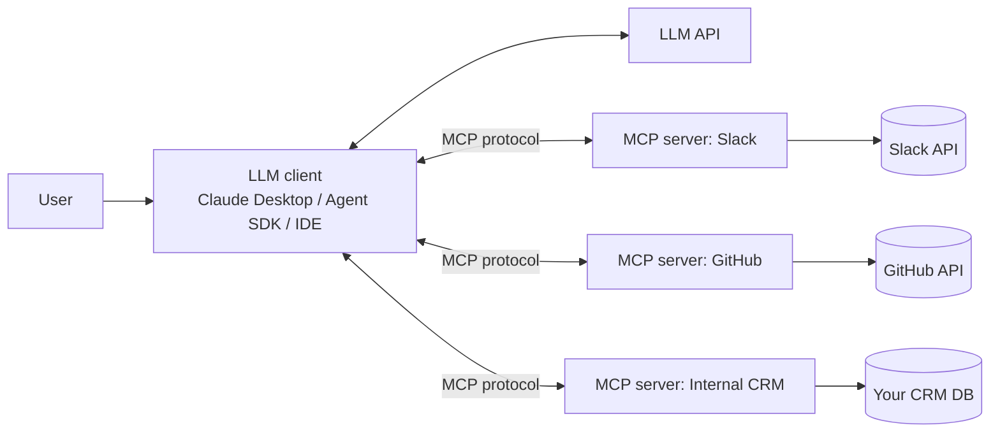

The LLM sees a unified tool set; the protocol handles transport, auth, and lifecycle.

### MCP capabilities
- **Tools** — functions the LLM can call (same shape as function calling).
- **Resources** — data the LLM can read (files, query results, structured docs).
- **Prompts** — reusable parameterized prompts the client can fetch.

### Numbers / operational notes
- MCP servers can be local (stdio, low latency, ~10ms overhead) or remote (HTTP+SSE, ~50–200ms overhead).
- Auth is per-server (OAuth, API key, mTLS — your choice).
- You can run MCP servers in containers and orchestrate them like microservices.

### Common pitfalls
- Putting business logic in the MCP client (it should live in the server).
- One giant MCP server for everything (defeats modularity — split by domain).
- Not versioning the MCP server's tool schemas (clients break silently).
- Confusing MCP with "an agent framework" — it's just a connector protocol; you still need an LLM and a loop.

## 2.10 Memory

### What it is
Persistent state that survives across turns / sessions / users. Required for agents that need to learn user preferences, recall past interactions, or maintain long-running goals.

### Four-tier memory model

| Tier | Holds | Storage | TTL |
|---|---|---|---|
| Working | Current conversation context | In-process / prompt | Single session |
| Episodic | Past interactions, events ("user asked X last Tuesday") | Vector DB or doc store | Days–months |
| Semantic | Extracted facts ("user lives in NYC", "user prefers concise replies") | Key-value store (Redis, Postgres) | Long-lived |
| Procedural | Learned how-tos / scripts / skills | Files / skills directory | Versioned |

### How memory works in practice

1. **At end of turn**: extract durable facts ("the user mentioned they're vegetarian") with a cheap LLM call.
2. **Store**: semantic facts → KV; episodic memories → embed + insert into a "memory" vector index keyed by user_id.
3. **At start of next turn**: retrieve relevant semantic facts (always) and episodic memories (RAG over the user's own memory index).

### Avoid: dumping all history into the prompt
This is the most common memory mistake. After 50 turns your prompt is 50K tokens of stale context. Use rolling summary + targeted retrieval.

### Forgetting & contradiction handling
- Newer facts override older ones — store with timestamp; retrieval orders by recency.
- Explicit "forget" signals from the user must be honored ("forget that I said X").
- Periodic compaction: a background job re-summarizes memory, drops obsolete facts.

### Numbers to drop
- Cost of a "memory extraction" call: ~$0.001 per turn with a cheap model.
- Storage: 1K users × 1K episodic memories × 1KB each = 1GB. Trivial.
- Retrieval latency: <50ms (small per-user indexes).

### Common pitfalls
- Treating "long context" as a replacement for memory (you'll lose data across sessions).
- Storing memories without timestamps (can't resolve conflicts).
- Sharing memory across users by accident (catastrophic privacy bug).
- Not letting users see / edit / delete their memories (GDPR risk).

## 2.11 Orchestration

### What it is
The control flow that turns one or many LLM calls into a working system.

### Five patterns, ordered by complexity

| Pattern | Use when | Cost |
|---|---|---|
| **Single LLM call** | Task fits in one prompt + response | 1× |
| **Chain** (fixed sequence) | You have known steps: parse → retrieve → generate → validate | 2–5× |
| **Router** (LLM picks one of N paths) | Mixed query types, only some need RAG/agents | 1–2× |
| **ReAct agent** (LLM loops with tools) | Unknown step count, branching | 5–20× |
| **Planner-Executor** | Long-horizon, decomposable, audited | 5–30× |

### When to pick which

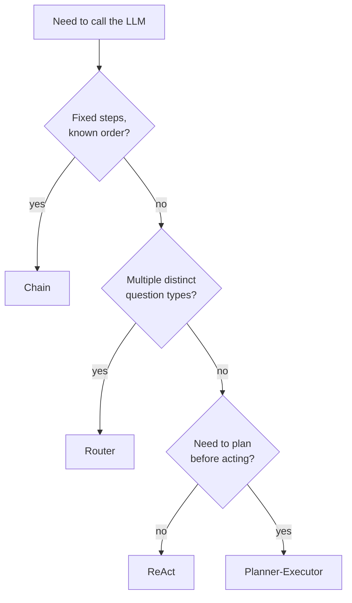

### ReAct loop sketch
```
1. LLM reasons + emits an action (tool call or final answer).
2. If action = tool: executor runs it, feeds result back.
3. If action = final: return.
4. Stop conditions (always): max steps, repeat detection, budget cap, timeout.
```

### Planner-Executor
- Planner LLM (typically larger) makes a plan: ordered list of steps.
- Executor LLM (typically smaller) runs each step.
- Optional Critic LLM reviews the result and decides whether to re-plan.

### Multi-agent
Multiple LLMs with different roles (researcher, writer, critic, etc.) that communicate. **Only use when the roles are genuinely different.** Most "multi-agent" systems are an over-engineered ReAct.

### Common pitfalls
- Defaulting to ReAct when a chain works (latency + cost explode).
- ReAct with no stop conditions (see Drill 10 in the prep doc).
- Planner-Executor where the plan never changes (a chain in disguise).

## 2.12 Caching

Three independent caches, do not confuse them.

### KV cache (server-side, inference)
- Inside the inference server (vLLM, TGI, TensorRT-LLM).
- Stores attention K/V tensors for tokens the model has already processed.
- Reduces *prefill* cost for repeated prefixes.
- Managed automatically by modern inference servers (PagedAttention in vLLM).

### Prompt cache (provider-side)
- Anthropic, OpenAI, Google all support it now.
- You mark a cacheable prefix (system prompt, tools, few-shots).
- On cache hit: ~10% (Anthropic) or 50% (OpenAI) of normal input cost. TTL ~5 min default; can be longer.
- **Biggest cost lever in production RAG.** Always cache the static prefix.

### Semantic cache (response cache, app-side)
- You embed the query, look up similar past queries (cosine > ~0.95).
- If hit: return the cached response without calling the LLM.
- Big wins for FAQ-shaped traffic (30%+ hit rate common).
- Risks: stale answers if underlying data changed. Use TTLs + cache invalidation on data updates.

### When to use which
- **KV cache** — always on (automatic).
- **Prompt cache** — always use it; structure prompts to maximize prefix reuse.
- **Semantic cache** — add at v2+ once you see repeat-query patterns.

### Numbers to drop
- Prompt cache savings: 70–90% of input tokens at scale.
- Semantic cache hit rate: 20–40% on FAQ-style traffic.
- Total cost reduction with both: 60–80% vs naive.

### Common pitfalls
- Putting dynamic content (user query, current time) in the cached prefix — no hits.
- Semantic cache without TTL — serving 6-month-old policy answers.
- Cache poisoning from the LLM's own hallucinations being cached.

## 2.13 Streaming

### What it is
Sending the LLM's response token-by-token to the client instead of waiting for the full response.

### Why it matters
TTFT (time to first token) is what the user feels. For a 1000-token response at 50 tok/s, total is 20s but TTFT can be 500ms. Streaming makes a 20-second response feel instant.

### Protocols
- **SSE (Server-Sent Events)** — HTTP-based, one-way (server → client). Default for chatbots.
- **WebSocket** — bidirectional, lower overhead at high frequency. Default for voice / real-time agents.
- **HTTP chunked transfer** — legacy, works without SSE library.

### What to stream
- Plain text deltas — easy.
- Structured output (JSON) — stream tokens but only parse on completion; or use **incremental JSON parsing** with libraries like partial-json.
- Tool calls — don't stream to the user; buffer until the call is complete.
- Final formatting — render markdown progressively (be careful with code blocks).

### Numbers
- Streaming saves ~80% of perceived latency for long responses.
- TTFT for Sonnet-class: ~500ms. For Haiku-class: ~300ms.
- Token rate: ~50–100 tok/s for closed APIs, ~30–80 tok/s self-hosted (depends on quantization, batch size).

### Common pitfalls
- Showing partial JSON to the user (looks broken).
- Streaming markdown without buffering — half-rendered code blocks.
- Not handling backpressure (client slow to consume → buffer overflow).

## 2.14 Validation & Guardrails

This is what the user emphasized — "till validation". Treat this as a major layer, not an afterthought.

### Input guardrails (before LLM call)
- **Prompt injection detection** — classifier that flags adversarial inputs ("ignore previous instructions"). Use a small model or a dedicated guardrail (Lakera, Anthropic's classifiers, in-house).
- **PII detection / redaction** — regex + ML (Presidio, AWS Comprehend) to strip SSNs, emails, phone numbers before logging/storage.
- **Content policy filter** — reject queries that violate your AUP (hate, violence, sexual content involving minors).
- **Length / cost cap** — reject queries > N tokens; reject when the user has exceeded their budget.

### Output guardrails (after LLM call)
- **Schema validation** — enforce JSON Schema / Pydantic. If invalid, regenerate once, then fall through to a safe error.
- **Faithfulness check (RAG)** — second LLM judges whether each claim is supported by retrieved context. Reject and regenerate if not.
- **Toxicity / safety filter** — classifier on output (Perspective, Llama Guard, OpenAI Moderation, Anthropic's classifiers).
- **PII leak detection** — re-check outputs for PII you didn't expect.
- **Citation enforcement** — for RAG, require that every factual claim has a citation. Reject otherwise.

### Tool guardrails (for agents)
- **Tool ACL** — only allowed tools are in the registry for a given user / role / workflow.
- **Per-tool approval thresholds** — destructive tools require human approval above a threshold (`delete_users(count > 100)` → approval).
- **Dry-run mode** — every side-effecting tool has a dry-run variant; the agent must run dry-run first.
- **Idempotency keys** — see 2.8.
- **Audit log** — every tool call recorded with `{user, args, result, timestamp, latency, cost}`.

### Compliance-specific
- **GDPR** — right to delete, right to access, data residency, lawful basis. Build a "delete user data" job that purges memories, conversation logs, embeddings.
- **HIPAA** — BAA with model provider, encryption at rest + in transit, audit trails, role-based access. Most closed APIs offer HIPAA-eligible endpoints.
- **SOC 2** — security controls, access logging, change management. Influences how you deploy, not really model choice.
- **PCI DSS** — never let cardholder data near the LLM. Tokenize before.

### Layering
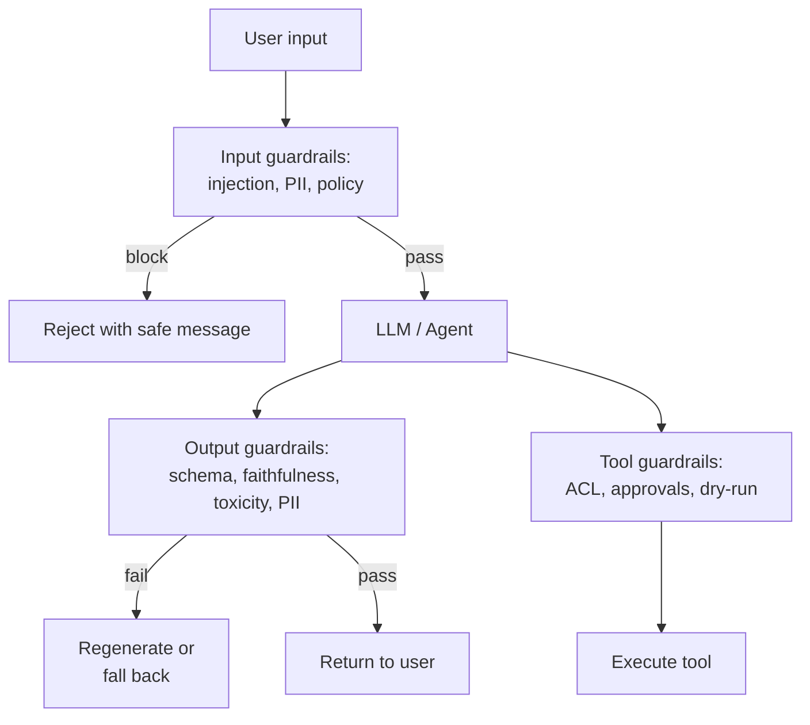

### Numbers
- Input guardrails: ~20–50ms each.
- Output faithfulness check: ~600ms (cheap judge model).
- Combined overhead: ~1s on top of the base LLM call. Acceptable for almost everything.

### Common pitfalls
- Treating guardrails as optional "v3 stuff" (they belong in v1 for any user-facing system).
- Using only input guardrails (most harms come from outputs).
- Hardcoding guardrails in the LLM prompt instead of as separate checks (one jailbreak and they're gone).
- No logging of *what guardrail fired* — you can't tune what you can't see.

## 2.15 Evaluation

### What it is
Measuring whether your system actually works. **Without eval, every "improvement" is a guess.**

### Three layers

| Layer | When | What it measures |
|---|---|---|
| Offline | Before any deploy | Quality on a labeled set |
| Shadow | Pre-launch | New version's outputs vs current |
| Online | Post-launch | Real-user behavior |

### Offline eval
- **Golden dataset** — 100–500 hand-labeled examples with ground-truth answers / citations / actions.
- **LLM-as-judge** — a more capable model scores outputs against a rubric. Cheap, scalable, biased — calibrate against human labels.
- **RAGAS metrics** (for RAG): faithfulness, answer relevance, context precision, context recall.
- **Task-specific metrics** — exact match (for extraction), pass@k (for code), ROUGE/BLEU (for summarization, weakly), citation accuracy.

### LLM-as-judge pitfalls
- Self-preference bias (the model favors its own outputs).
- Position bias (favors the first option in pairwise comparison).
- Length bias (favors longer outputs).
- Mitigations: randomize positions, calibrate against humans, use a *different* model class as the judge, agreement rate > 0.7 with humans.

### Shadow mode
Run the new system alongside the current one. Don't return its output to the user. Log both. Compute deltas:
- % of cases where the new system improved
- % where it regressed
- Cost / latency deltas

### A/B test
Split traffic 50/50 (or 90/10 for new launches). Track quality (via passive signals + active LLM-as-judge), cost, latency, user satisfaction (CSAT, thumbs up/down). Run for statistical significance (typically 1–2 weeks).

### Production metrics (online eval)
- **CSAT / thumbs** — explicit user signal.
- **Refusal rate** — how often the system says "I can't help with that".
- **Abstention rate** — how often it correctly says "I don't have info on that".
- **Resolution rate** (for support) — how often the conversation ends without escalation.
- **Citation accuracy** (sampled) — humans check 1% of outputs for cited-claim accuracy.

### Numbers
- Golden set size: 100 minimum, 500+ ideal.
- Eval run time: 5 min for 100 queries × 1 LLM call. Larger for agents.
- Cost of LLM-as-judge: ~$0.001 per (output, judgment) pair with a small judge.

### Common pitfalls
- No golden set (every improvement is vibes).
- Golden set drifted from prod distribution (eval shows green; users see red).
- Single eval signal (cost, latency, quality must all be tracked).
- LLM-as-judge as ground truth without human calibration.

## 2.16 Monitoring & Observability

### What it is
What happens in production. The instrumentation that lets you debug, optimize, and stay safe.

### Per-call telemetry (log every call)
- request_id, user_id, tenant_id, session_id
- timestamp, model, prompt_template_version
- input_tokens, output_tokens, cached_tokens
- latency: TTFT, total
- cost ($)
- tool calls: name, args (redacted), result_status, latency, cost
- guardrail decisions: which fired, on what
- final response_id (for thumbs feedback to link back)

### Dashboards (must-have)
- Cost / day, broken out by model, tenant, route
- Latency p50 / p95 / p99
- Error rate (LLM API errors, tool errors, guardrail rejections)
- Token usage trends (catch context bloat early)
- Tool-call distribution (find rogue agents)
- Cache hit rates (prompt cache, semantic cache)
- Eval score over time (offline + online)

### Alerts
- Cost > N × baseline for any tenant
- Latency p95 > SLO
- Faithfulness check failure rate > X%
- Guardrail block rate spike (sign of attack)
- Tool error rate > 5%

### Audit trail (compliance)
Immutable log of: who, what, when, why, with what tool, for how much. Used for incident response and compliance audits. Store separately from operational logs; longer retention.

### Tools
- OpenTelemetry + your existing APM (Datadog, New Relic, Honeycomb)
- LLM-specific: Langfuse, Arize Phoenix, Helicone, LangSmith, Weights & Biases Weave
- Log destination: BigQuery / Snowflake / S3+Athena for analytics

### Common pitfalls
- Logging raw prompts with PII (compliance bomb). Redact before logging.
- No request_id (can't correlate across services).
- Aggregating away tenant_id (can't debug a specific customer).
- Sampling tool calls (you'll miss the rare loop).

---

# Part 3 — 10 Worked Use Cases (v1 / v2 / v3)

For each use case, the pattern is the same:

1. **Problem statement** — one paragraph.
2. **Decision** — LLM / RAG / Agent + the reasoning chain.
3. **v1** — simplest thing that demos value. Every component justified.
4. **v2** — what v1 failed at; what we add to fix it.
5. **v3** — what v2 hits at scale; production-grade additions.
6. **Don't bother with v3 if…** — when to stop.

---

## Use Case 1: Internal Knowledge Q&A Bot

### Problem
A 5,000-person company has 50,000 internal docs in Confluence + Google Drive + Notion. Employees waste time finding policies, runbooks, and onboarding info. Build a Q&A bot that answers questions and cites sources.

### Decision
- Needs **private data** (internal docs) → RAG mandatory.
- No actions in the world → no agent in v1.
- Some questions are multi-hop ("Which engineering teams use Datadog and what's our incident response policy?") → may need agentic RAG at v3.

**Path: RAG → Agentic RAG**

---

### v1 — Vanilla RAG with a fixed top-k

**Goal**: ship in 2 weeks; prove people use it; collect failure modes.

#### Architecture
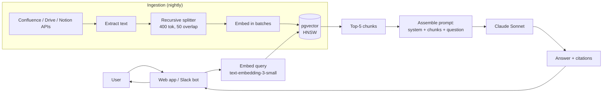

#### Component justifications

| Component | Choice | Why |
|---|---|---|
| LLM | Claude Sonnet 4.5 | Strong on instruction following + citations, 200K context |
| Embedding | text-embedding-3-small | $0.02/1M tokens, strong baseline, no GPU ops |
| Vector DB | pgvector | Postgres already in stack; <10M chunks; HNSW index |
| Chunking | recursive splitter, 400 tok / 50 overlap | Strong default; preserves paragraph integrity |
| Retrieval | top-5 dense only | Simplest; we'll measure recall |
| Prompt | system + 5 chunks + question + "cite chunk_id" | Forces grounding |
| Caching | prompt cache on system prefix | Free 70% input cost savings |
| Validation | Schema-validate output (answer + citations[]) | Catches malformed responses |
| Eval | 50 hand-labeled Q&A pairs | Smallest useful golden set |
| Monitoring | log {query, retrieved_ids, answer, latency, cost} | Foundation for debugging |

#### Numbers
- Ingestion: 50K docs × ~10 chunks each = 500K chunks. Embedding cost: 500K × 400 tok × $0.02/1M = $4. One-time.
- Storage: 500K × 1536 × float16 = ~1.5GB. Fits in RAM on a single m5.large.
- Query latency: ~50ms retrieval + ~1.5s LLM = ~1.6s p50.
- Cost per query: ~$0.005 (mostly LLM with prompt cache).

#### Known v1 limitations (worth surfacing to interviewer)
- No reranking — precision will be mediocre.
- No hybrid search — exact-term queries (acronyms, product names) miss.
- No multi-hop — compound questions get bad answers.
- No streaming — feels slow.
- No per-tenant ACL — every doc is visible to every employee.

---

### v2 — Hybrid search + reranking + ACL + streaming

**Goal**: address the top failure modes from v1's first month in prod.

#### What failed in v1
1. **Precision is bad** — top-5 has 2 relevant + 3 noise → LLM gets distracted, answer quality drops.
2. **Acronym queries miss** — "what's our SOC2 status?" doesn't retrieve the doc that says "SOC 2".
3. **Some docs are confidential** — engineering employees see HR docs they shouldn't.
4. **2-second response feels slow** — users abandon before answer.

#### What we add

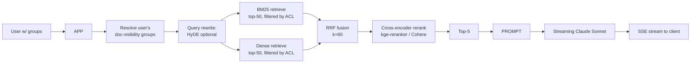

#### New components

| Added | Why | How |
|---|---|---|
| BM25 sparse retrieval | Fixes acronym / exact-term misses | OpenSearch or pgvector + Postgres tsvector |
| RRF fusion | Combine sparse + dense without hand-tuning | `score = Σ 1/(60 + rank)` |
| Cross-encoder rerank | Lift precision@5 from ~0.45 to ~0.80 | Cohere Rerank or self-hosted bge-reranker-large |
| ACL filter in retrieval | Compliance / least-privilege | Each chunk carries `visibility_groups: [...]`; filter at retrieve time |
| Streaming via SSE | TTFT drops from 1.6s to ~500ms | Anthropic streaming API + SSE in Express/FastAPI |
| Larger eval set | 50 → 300 hand-labeled Q&A | Built from real prod queries + thumbs-down examples |
| RAGAS in CI | Catch faithfulness regressions on every prompt change | Faithfulness, answer relevance, context precision/recall |
| Semantic cache | 30% of queries are repeats | Per-tenant index keyed on query embedding, threshold 0.95 |

#### Numbers
- Cost per query: ~$0.003 (semantic cache + prompt cache).
- p50 latency: 500ms TTFT, 2.5s total.
- Precision@5 (measured on golden set): 0.45 → 0.82.
- Cache hit rate: 30% (saves ~$30/day at 10K queries).

---

### v3 — Agentic RAG + multi-doc reasoning + per-tenant tuning

**Goal**: handle the 15% of questions v2 still gets wrong — multi-hop, comparative, "synthesize across docs".

#### What failed in v2
1. **Multi-hop questions fail** — "Which teams use AWS *and* have on-call rotation defined?" needs two separate retrievals + a join.
2. **Long-tail policies have only one doc** — retrieval is right but reranker buries it among similar-looking docs.
3. **High-stakes domains (legal, security) need stricter faithfulness** — one wrong citation costs reputation.

#### Architecture additions

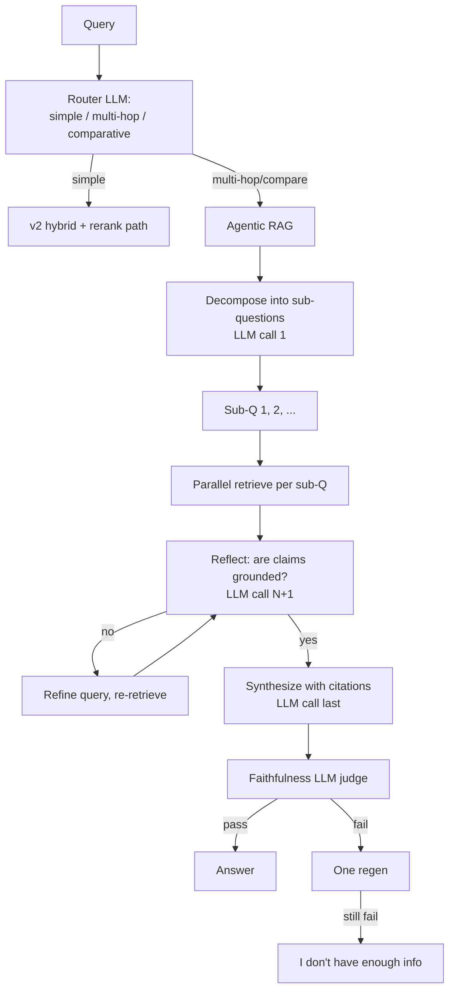

#### Why each piece

| Added | Why |
|---|---|
| Router LLM | Don't pay agentic cost for the 80% simple-lookup traffic |
| Decomposition | Multi-hop fix |
| Parallel sub-retrievals | Latency stays bounded (~2× v2, not 5×) |
| Reflection step (Self-RAG lite) | Catches missing context before generation |
| Faithfulness judge as gate | One in 50 outputs gets reviewed by an LLM judge before sending |
| Per-tenant fine-tuning of reranker | Domain specialization where it counts |
| Compliance-grade audit log | Every retrieval + tool call + judge decision logged for security review |

#### Numbers
- 80% of traffic stays on v2 path (~$0.003, 2.5s).
- 20% takes agentic path (~$0.03, 7s).
- Multi-hop accuracy: ~40% → ~85% on the multi-hop subset of the golden set.
- Faithfulness pass rate: 88% → 96%.

### Don't bother with v3 if…
- v2 prod metrics show <5% multi-hop queries.
- The corpus is small enough (< 50K tokens) that you can stuff it in long-context and skip RAG entirely for the hard questions.

---

## Use Case 2: Customer Support Assistant

### Problem
A SaaS company with 200K customers gets 5K support tickets/day. 60% are simple lookups ("where's my invoice?", "reset my password"). Build an AI assistant that handles tier-1 tickets, escalating only when needed.

### Decision
- Needs **fresh data** (account state, current orders, ticket history) → RAG and/or Tools.
- Needs to **take actions** (reset password, refund, update profile) → Agent path.
- Mixed query types → router + agent.

**Path: LLM + Tools (v1) → Agent + RAG + Tools (v2) → Multi-step agent with escalation (v3)**

---

### v1 — LLM with 3 tools, one-shot

**Goal**: handle the easiest 30% of tickets (lookups + password reset) end-to-end.

#### Architecture
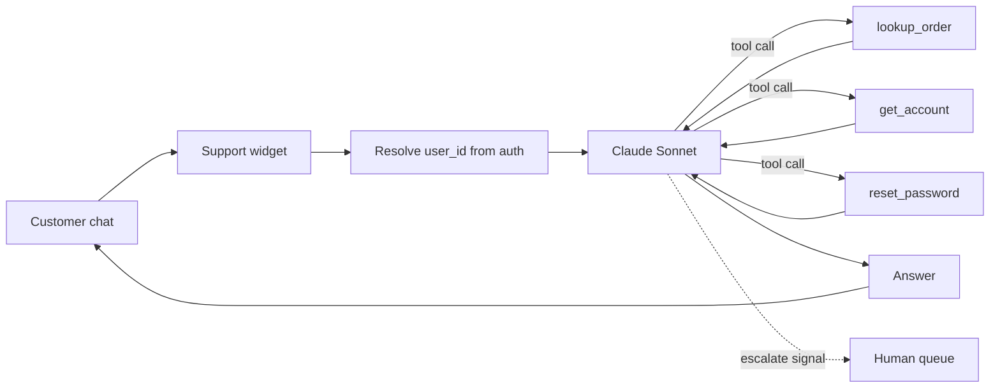

#### Tools
```json
[
  {"name": "lookup_order", "input": {"order_id": "string"}},
  {"name": "get_account", "input": {"user_id": "string"}},
  {"name": "reset_password", "input": {"user_id": "string", "channel": "email|sms"}}
]
```

All read-only except `reset_password`, which requires an idempotency key.

#### Component justifications

| Component | Choice | Why |
|---|---|---|
| LLM | Sonnet 4.5 | Strong tool use, low refusal rate |
| Tools | 3 narrow, strict JSON schemas | Easier model to learn |
| No RAG | Knowledge isn't the bottleneck yet — lookups dominate | Defer complexity |
| Streaming | SSE | Feels responsive |
| Escalation rule | LLM emits `{intent: "escalate", reason: ...}` → routes to human queue | Safety net |
| Validation | Pre-tool: idempotency key required for `reset_password`; rate-limit per user | Prevents abuse |
| Eval | 100 ground-truth tickets with expected resolution path | Tracks accuracy + escalation rate |
| Monitoring | Per-tool error rate, escalation rate, CSAT thumbs | Top-line health |

#### Numbers
- ~$0.01/ticket (1 LLM call, ~3K input tokens, ~500 output).
- p50 latency: 3s (multi-tool chain).
- v1 resolution rate (no escalation): ~25%. Escalation rate: ~75%.

---

### v2 — RAG over KB + 10 more tools + memory

**Goal**: lift resolution from 25% → 50% by adding the help center + more actionable tools + a tiny memory.

#### What failed in v1
1. **"How do I configure SSO?" → escalate** (no tool, no KB).
2. **"Refund my last invoice"** → escalate (no refund tool).
3. **"I already told you my issue last week"** → no memory, customer repeats themselves.
4. **5-tool decision sometimes picks wrong tool** (router-style failure).

#### What we add

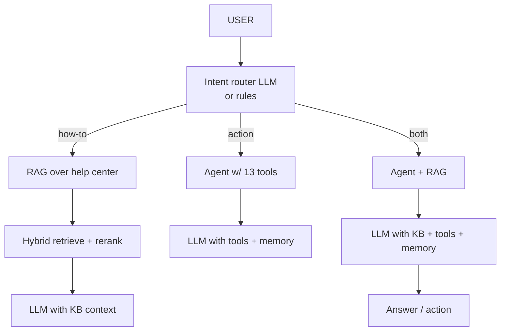

#### New components

| Added | Why |
|---|---|
| RAG over help center (~5K articles) | Handles how-to questions without escalation |
| Hybrid retrieval + rerank | Same as v2 in Use Case 1 |
| 10 new tools: `issue_refund`, `update_address`, `cancel_subscription`, `apply_credit`, `change_plan`, `update_email`, `update_payment_method`, `pause_subscription`, `add_user_to_team`, `escalate_to_human` | Cover top-action SKUs |
| Per-tool approval thresholds | `issue_refund > $500` requires human approval inline |
| Memory (semantic + episodic) | Remember user preferences ("contact via email"), past complaints ("billing on Jan 15") |
| Router LLM | Pick the path; reduces tools-in-prompt from 13 to relevant 3 |
| Bigger eval set: 500 tickets, labeled with correct resolution | Required for nuance |
| Faithfulness gate on KB answers | Don't make up policy |
| Tool ACL by user tier | Free users can't trigger refunds above $50 |

#### Numbers
- ~$0.03/ticket (sometimes 3–4 LLM calls).
- p50 latency: 5s.
- Resolution rate: 25% → 52%.
- Refund accuracy (sampled): 99.3% (we're paying for the eval here).

---

### v3 — Multi-step agent + cross-system orchestration + human handoff

**Goal**: handle complex tickets like "my last invoice is wrong AND I want to upgrade my plan AND change my billing email" in one session.

#### What failed in v2
1. **Compound tickets fail** — agent only handles one intent per turn.
2. **Mid-conversation handoff loses context** — when escalated, the human sees a blob, not a summary.
3. **Power users want bulk actions** — "cancel all my unused subscriptions" requires planning.
4. **Cost spikes from rare loops** — one user with confusing context drives a 30-step agent run.

#### Additions

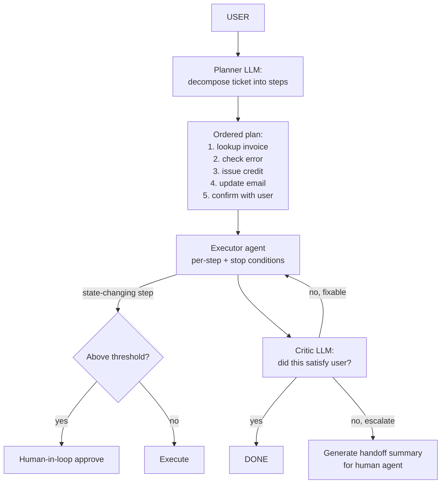

#### Why each piece

| Added | Why |
|---|---|
| Planner-Executor split | Compound tickets need explicit planning |
| Critic LLM | Self-correction without unbounded looping |
| Hard stop conditions (max 10 steps, $0.50 budget, 30s wall clock) | Cost safety |
| Handoff summary generator | Smooth human transition |
| Multi-system MCP servers (Stripe, Salesforce, Zendesk, internal billing) | Standardize integrations across multiple AI surfaces (web, IDE, mobile) |
| Audit log: every tool call + every plan + every critic decision | Compliance + debugging |
| Shadow mode for new prompts: every prompt change shadow-runs for 1 week before promotion | Catches regressions before rolling out |
| Per-customer SLOs and cost budgets | Enterprise customers pay for SLOs |

#### Numbers
- ~$0.08/ticket (compound) and $0.03/ticket (simple, still on v2 path).
- p50 latency: 8s compound, 5s simple.
- Resolution: 52% → 70%.
- Escalation quality (CSAT after handoff): up 30%.

### Don't bother with v3 if…
- < 10% of tickets are compound (rare in most SaaS).
- Your support team headcount isn't constrained (cheaper to escalate than to build planner-executor).

---

## Use Case 3: Code Review Bot

### Problem
A 500-engineer org wants an AI reviewer that comments on PRs: style, bugs, missing tests, security issues. Should integrate with GitHub.

### Decision
- Diff is small enough to fit in prompt → no RAG required for v1.
- Quality requires context from neighboring code → RAG by v2.
- "Suggest a patch and run tests" → Agent by v3.

**Path: LLM (v1) → RAG (v2) → Agent (v3)**

---

### v1 — LLM-only on the diff

**Goal**: ship a useful PR comment bot in 1 week.

#### Architecture
```mermaid
flowchart LR
  PR[GitHub PR webhook] --> DIFF[Fetch diff]
  DIFF --> CHECK[Size check:<br/>skip if > 50K tokens]
  CHECK --> PROMPT[System + style guide + diff]
  PROMPT --> LLM[Claude Sonnet]
  LLM --> JSON[Output: comments[]<br/>JSON Schema]
  JSON --> POST[Post comments via GitHub API]
```

#### Components

| Component | Choice | Why |
|---|---|---|
| LLM | Sonnet 4.5 or Opus for harder reviews | Quality dominates |
| Prompt | role + repo-specific style guide + diff | Style guide must be specific |
| Output schema | `{comments: [{file, line, body, severity}]}` strict JSON | Postable to GitHub API |
| Prompt cache | system + style guide (~3K tokens) | Saves 90% input cost across PRs |
| Streaming | none (not user-facing) | Async is fine |
| Validation | JSON Schema + file/line existence check | Reject hallucinated line numbers |
| Eval | 100 PRs with human-curated "good comments" | Gold standard |
| Monitoring | comments per PR, accept rate (from engineers reacting), cost | Track quality drift |

#### Numbers
- ~$0.05 per PR (5–10K tokens).
- Latency: 5–15s.
- Engineer acceptance rate (sampled): 35% (varies wildly by team).

---

### v2 — RAG over the codebase

**Goal**: catch bugs that require knowledge of how the changed function is *called*, not just what it does.

#### What failed in v1
1. **Suggests a refactor that breaks 12 call sites** — no awareness of callers.
2. **Recommends a pattern the team explicitly rejected** — no knowledge of past PR discussions.
3. **Misses domain conventions** — "we always use `decimal.Decimal` for money in this repo".

#### What we add

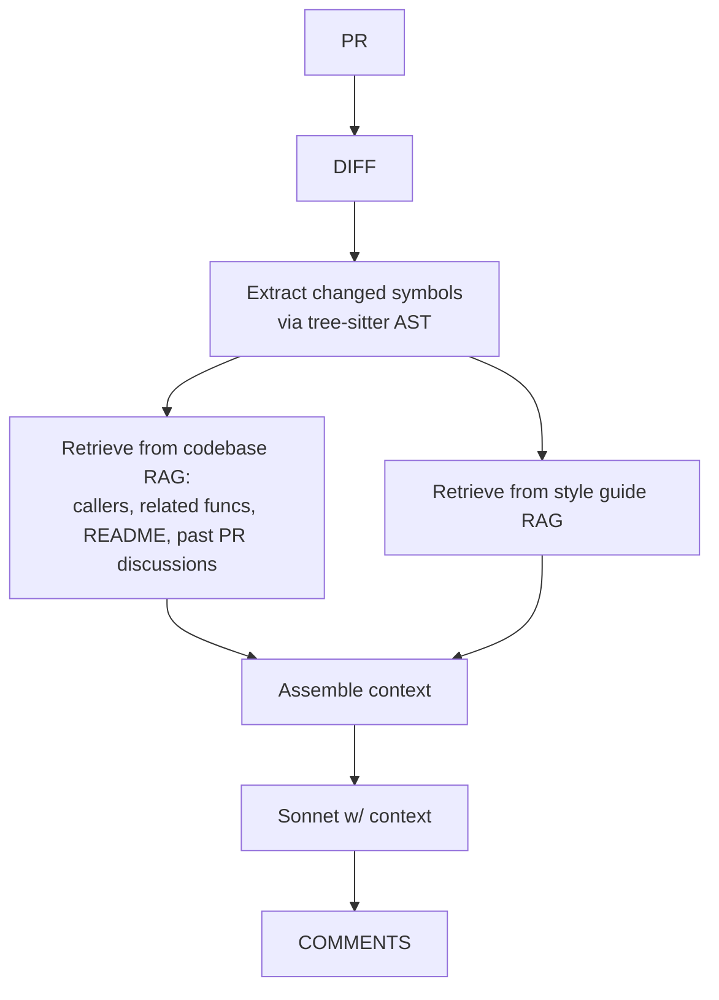

#### New components

| Added | Why |
|---|---|
| Code chunking via AST (tree-sitter) | Functions stay whole |
| Embedding model: voyage-code-2 or domain-tuned | Code-specific models outperform general |
| Codebase vector index | Find callers, related funcs |
| Past PR comments index | Capture team conventions |
| Symbol extraction (changed funcs/classes) | Query strategy |
| Reranker (bge-reranker-base) | Precision@5 on retrieved code |
| Larger eval set (500 PRs) with per-comment human labels | Critical for tuning |
| LLM-as-judge for comment quality | Cheap scaling of eval |

#### Numbers
- ~$0.12 per PR (more context, more tokens).
- Latency: 10–25s.
- Accept rate: 35% → 55%.

---

### v3 — Agent with tools (read code, run tests, propose patch)

**Goal**: not just comment, but **fix**.

#### What failed in v2
1. **Comments without patches are ignored** — engineers want suggestions they can click-apply.
2. **Some bugs need running the test to confirm** — static analysis misses runtime issues.
3. **Cross-repo bugs (shared lib changed)** — single-repo RAG misses them.

#### Additions

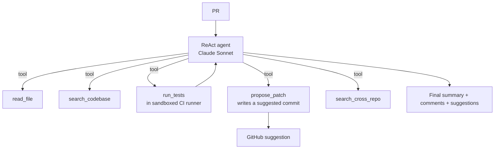

#### Why each piece

| Added | Why |
|---|---|
| ReAct agent with code-aware tools | Explore the codebase only as needed (cost control) |
| Sandboxed test runner | Confirm proposed changes don't break tests |
| `propose_patch` tool that emits a GitHub Suggestion | Click-to-apply improves acceptance |
| Cross-repo search | Shared-lib refactors |
| Stop conditions: max 15 steps, $1 budget, 5min wall clock | Cost safety |
| Bigger eval: 1000 PRs with detailed labels | Statistical confidence |
| Shadow mode for prompt changes | Don't regress prod |
| Audit log for every patch posted | Security review |

#### Numbers
- ~$0.50 per PR (agent + tests).
- Latency: 30s–5min.
- Accept rate: 55% → 75%; patch click-apply rate: 40%.

### Don't bother with v3 if…
- Most of your value is in comments, not fixes.
- You don't have a sandboxed test runner (build that first).

---

## Use Case 4: Email Drafting Assistant

### Problem
Knowledge worker users want an "AI draft reply" button in Gmail/Outlook. Replies should match the user's voice, reference the right details, and respect calendar/contact context when relevant.

### Decision
- Needs **personal data** (user's past emails, calendar) → RAG.
- Sometimes needs to **act** (schedule a meeting, attach a file) → tools at v2/v3.
- Always needs the user to approve before sending → never auto-send.

**Path: LLM (v1) → LLM + RAG over user's mail (v2) → Agent with calendar/contacts tools (v3)**

---

### v1 — LLM drafts from the current thread

#### Architecture
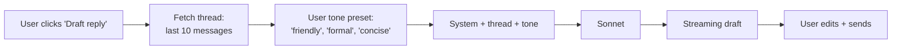

#### Components

| Component | Choice | Why |
|---|---|---|
| LLM | Sonnet | Voice / tone matching |
| Context | last 10 messages of thread | Usually enough; bounded cost |
| Tone preset | user-set in settings | Cheap personalization |
| Streaming | SSE | UX critical for typing |
| No RAG | Defer until "match user's voice" demands it | YAGNI |
| Validation | Just length cap; let user be the editor | Trust the human |
| Eval | 50 hand-evaluated drafts (helpfulness, voice match, factuality) | Small but meaningful |

#### Numbers
- ~$0.005/draft.
- p50 TTFT: 600ms.

---

### v2 — RAG over the user's mail history

#### What failed in v1
1. **Doesn't match the user's voice** — too generic.
2. **Doesn't know prior context** — "as we discussed last week" — what was discussed?
3. **Recommends wrong details** — "let's meet at the same coffee shop" without knowing the shop.

#### Additions

```mermaid
flowchart LR
  USER --> CTX[Fetch thread]
  CTX --> Q[Generate "context query" for RAG]
  Q --> RAG[Retrieve from user's<br/>past emails to this contact]
  RAG --> ASSEMBLE
  CTX --> ASSEMBLE[System + thread + past relevant emails + tone]
  ASSEMBLE --> LLM
  LLM --> DRAFT
```

#### New components

| Added | Why |
|---|---|
| Per-user mail index (incremental, real-time) | Match voice + recall prior discussions |
| Query rewrite: "what did the user previously discuss with this contact about [topic]?" | Smart retrieval |
| Tone learned from samples (not just preset) | Better voice match |
| Strict per-user data isolation | Privacy non-negotiable |
| Eval: human ratings of voice match, factuality | Voice match is hard to measure with LLM-as-judge |
| Memory: facts about contacts ("Sarah prefers brief replies") | Personalization layer |

#### Numbers
- ~$0.01/draft (extra retrieval + larger context).
- p50 TTFT: 800ms (small bump).

---

### v3 — Agent with calendar / contacts / attachments / scheduling

#### What failed in v2
1. **"Schedule a meeting next week" → user has to manually pick time** — agent can do it.
2. **"Attach the Q3 deck" → user goes hunting** — agent can find + attach.
3. **"Reply to all of these similar emails the same way" → manual** — batch agent.

#### Additions

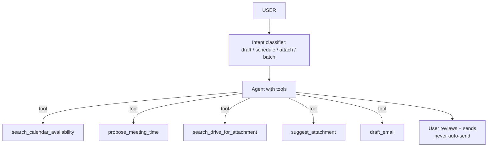

#### Why each piece

| Added | Why |
|---|---|
| MCP servers for Google / Microsoft 365 | Standard auth + tool layer; reusable across other AI surfaces |
| Tool: calendar availability | Scheduling intent |
| Tool: drive search | Attachment intent |
| Tool: batch draft (loop with confirmation) | Power-user feature |
| Hard rule: never sends without user click | Safety |
| Per-action audit log | Compliance |
| Eval: action-completion rate + post-send CSAT | Tracks the full UX |

#### Numbers
- ~$0.02–$0.05 per session (varies with tool calls).
- Action latency: 2–4s.
- Adoption: depends on UX more than ML.

### Don't bother with v3 if…
- You don't have enterprise calendar/drive integration access (huge auth/scope lift).
- Users prefer to keep email and scheduling separate.

---

## Use Case 5: Text-to-SQL Analytics Agent

### Problem
A 1,000-person company has 50 dashboards but analysts get 200 ad-hoc requests/week. Build a "ask your data" chatbot over the warehouse (Snowflake/BigQuery).

### Decision
- Needs **fresh data** (live warehouse) → tool (SQL execution).
- Needs **private schema knowledge** → RAG over schema docs.
- Needs to **execute queries** → Agent with `run_sql` tool.

**Path: LLM + tool (v1) → LLM + RAG + tool (v2) → Agent with validate/execute/retry/viz (v3)**

---

### v1 — LLM with schema in prompt + a single `run_sql` tool

#### Architecture
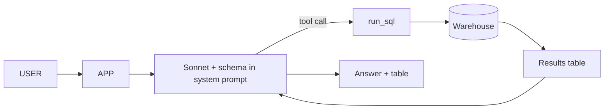

#### Components

| Component | Choice | Why |
|---|---|---|
| LLM | Sonnet (strong on SQL) | Quality dominates |
| Schema | top 30 tables fit in 8K tokens; embed in system | Simple; prompt-cached |
| Tool | `run_sql(query, max_rows=1000)` strict schema | One job |
| Read-only DB user | enforced at connection layer | Safety |
| Row limit | 1000 max | Cost + safety |
| Timeout | 30s | Prevents runaway |
| Validation | Parse SQL; reject DDL/DML | Whitelist allowed statements |
| Eval | 50 questions with ground-truth queries | Tracks SQL accuracy |

#### Numbers
- ~$0.02/query (sometimes 2 LLM calls if first SQL errors).
- p50 latency: 4s.
- v1 accuracy on golden set: 55%.

---

### v2 — RAG over schema, sample queries, and lineage

#### What failed in v1
1. **Hallucinates column names** — table has 200+ columns; LLM picks wrong one.
2. **Doesn't know business definitions** — "active user" means different things in different schemas.
3. **Generates inefficient SQL** — full table scans on petabyte tables.

#### Additions

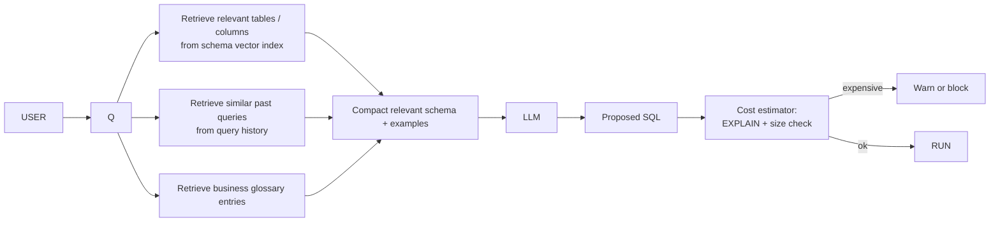

#### New components

| Added | Why |
|---|---|
| Schema RAG (per-column docs, types, sample values) | Reduces column hallucination |
| Query history index (past good SQL) | Few-shot from prior wins |
| Business glossary | Resolves "active user" ambiguity |
| `EXPLAIN`-based cost guard | Block obviously expensive queries |
| LLM-as-judge for SQL correctness on golden set | Cheaper than manual review |
| Per-team data ACL | Sales can't query payroll |

#### Numbers
- ~$0.04/query.
- p50 latency: 6s.
- Accuracy: 55% → 78%.

---

### v3 — Agent with validate / execute / retry / visualize

#### What failed in v2
1. **One-shot SQL fails on hard joins** — agent should iterate.
2. **No visualization** — user gets a 1000-row CSV.
3. **No follow-up support** — "now break this down by region" requires context.
4. **Same wrong answer twice in a row** — no learning.

#### Additions

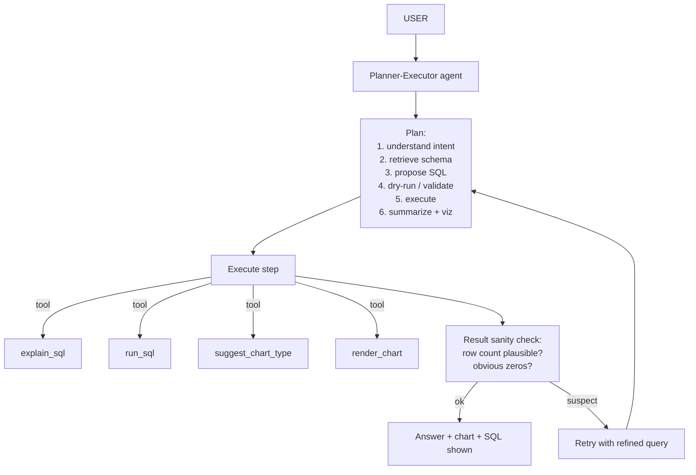

#### Why each piece

| Added | Why |
|---|---|
| Planner-Executor | Compound queries need multiple steps |
| Critic / sanity check | Catches "0 results because of a typo in the join" |
| Chart suggestion tool | Better UX |
| Conversational memory (working) | Follow-ups feel natural |
| Adversarial test set (broken schemas, weird intents) | Catches edge cases pre-prod |
| Shadow mode on prompt changes | No regressions |
| Per-tenant query budget | Don't blow the warehouse bill |

#### Numbers
- ~$0.10–$0.20/query.
- p50 latency: 10s (worth it for accuracy).
- Accuracy: 78% → 90%.

### Don't bother with v3 if…
- Your warehouse can't easily expose `EXPLAIN` and cost estimates (table stakes for safety).
- Analysts prefer to write their own SQL (cultural fit matters).

---

## Use Case 6: Document Extraction (Invoices / Contracts / Forms)

### Problem
A 50K-employee enterprise processes 100K invoices/month in 30 languages. Each invoice (PDF or image) must yield ~30 structured fields (vendor, line items, taxes, totals, PO match) that go straight to the ERP.

### Decision
- Input is unstructured docs → vision LLM or layout-aware parser.
- Output is **JSON, not prose** → strict schema, not chat.
- No actions in the world (write to ERP via separate ETL) → no agent in v1.
- Errors cost money → heavy validation.

**Path: Vision LLM (v1) → + layout parser + validators (v2) → + human-in-loop + active learning (v3)**

---

### v1 — Vision LLM with strict schema

#### Architecture
```mermaid
flowchart LR
  PDF[Invoice PDF / image] --> PRE[Preprocess:<br/>render to 2048px image<br/>OCR fallback if text-PDF]
  PRE --> VLM[Vision LLM<br/>Claude Sonnet / GPT-4o]
  VLM --> JSON[Strict JSON output:<br/>{vendor, total, currency, line_items[...]}]
  JSON --> VAL[Schema + sanity validate]
  VAL -->|ok| Q[Queue for ERP push]
  VAL -->|fail| HUMAN[Manual queue]
```

#### Components

| Component | Choice | Why |
|---|---|---|
| Vision LLM | Claude Sonnet 4.5 (or GPT-4o) | Both strong on documents |
| Strict JSON output | Yes — output_schema enforced | Catches malformed |
| Schema validation | Pydantic + custom (total = sum(line_items)) | Math sanity check |
| Sanity rules | currency in ISO list; date plausible; total > 0 | Catches obvious wrong |
| Confidence | LLM emits per-field confidence (0-1) | Routes low-confidence to human |
| No RAG | Defer until accuracy demands it | Simplicity |
| Eval | 200 invoices with ground-truth fields | Per-field accuracy |

#### Numbers
- ~$0.08/invoice (vision is expensive).
- Latency: 3–6s.
- v1 per-field accuracy: 88% avg, 95% on simple fields (total, currency), 78% on tricky (line items).
- Auto-process rate (all fields pass validation): 65%.

---

### v2 — Layout parser + per-field validators + ensembling

#### What failed in v1
1. **Multi-page invoices lose context across pages** — line items split.
2. **Tables of line items get garbled** — vision LLM struggles with dense tables.
3. **Handwritten or stamped fields fail silently** — confidence reported as high.
4. **PO match needs cross-reference to ERP** — single-doc context insufficient.

#### Additions

```mermaid
flowchart TD
  PDF --> LAYOUT[Layout parser:<br/>Unstructured / Azure DI / Textract]
  LAYOUT --> SEG[Segmented:<br/>header / table / footer / pages]
  SEG --> ROUTE[Per-segment specialist]
  ROUTE -->|header| VLM_H[Vision LLM]
  ROUTE -->|table| TBL[Table extractor +<br/>row-level VLM check]
  ROUTE -->|footer| VLM_F[Vision LLM]
  VLM_H --> ASSEMBLE
  TBL --> ASSEMBLE
  VLM_F --> ASSEMBLE[Assemble]
  ASSEMBLE --> VAL[Stage 1: schema]
  VAL --> XREF[Stage 2: ERP cross-ref:<br/>PO match, vendor match]
  XREF --> ENS[Optional ensemble:<br/>two VLMs agree?]
  ENS --> Q[Queue or human review]
```

#### New components

| Added | Why |
|---|---|
| Layout-aware parser (Unstructured / Azure DI) | Splits doc into header/table/footer reliably |
| Specialist per-segment extraction | Table extractor handles tables; VLM handles narrative |
| Cross-reference to ERP | PO + vendor sanity check |
| Ensemble (two models must agree on critical fields) | Cuts wrong-total rate |
| Per-vendor templates (learned over time) | Recurring vendors have stable layouts |
| Eval: 2K invoices labeled across 20 vendor templates | Statistical power |
| Active learning loop: low-confidence → human → re-train templates | Continuous improvement |

#### Numbers
- ~$0.20/invoice (more calls).
- Latency: 5–10s.
- Auto-process rate: 65% → 88%.
- Wrong-field rate (post auto-process): from ~2.5% to ~0.4%.

---

### v3 — Human-in-loop + active learning + active learning data flywheel

#### What failed in v2
1. **Human-review queue grows uncontrollably** — 12% × 100K/month = 12K manual reviews.
2. **Vendor template learning is brittle** — new vendor takes weeks to stabilize.
3. **Errors caught downstream (in ERP) don't loop back** — same mistakes recur.

#### Additions

```mermaid
flowchart TD
  V2[v2 extraction] --> CONF{Confidence ≥ threshold<br/>and validators pass?}
  CONF -->|yes| AUTO[Auto-process]
  CONF -->|no| QUEUE[Smart queue<br/>prioritized by value × risk]
  QUEUE --> HUMAN[Human reviewer w/ side-by-side<br/>+ field-level confidence]
  HUMAN --> CORRECT[Corrections logged]
  CORRECT --> RL[Retrain templates<br/>weekly batch]
  CORRECT --> EVAL[Update golden set]
  AUTO --> ERP_PUSH
  ERP_PUSH --> ERP_FEEDBACK[ERP reports rejection]
  ERP_FEEDBACK --> CORRECT
```

#### Why each piece

| Added | Why |
|---|---|
| Confidence-based routing | Send only the worst 5–10% to humans |
| Reviewer UI with field-level diffs | Reviewers correct in seconds, not minutes |
| Active learning batch retraining | Templates and prompts improve weekly |
| ERP feedback loop | Catches errors v2 didn't catch |
| Per-vendor accuracy dashboard | Flags regressions early |
| PII redaction in logs | Compliance |
| Multi-language eval set | Catch cross-lingual regressions |

#### Numbers
- ~$0.15/invoice blended (cheaper extractions on stable templates).
- Auto-process rate: 88% → 95%.
- Time-to-stable for new vendor: weeks → 2 days.

### Don't bother with v3 if…
- Your reviewers can keep up with v2's queue.
- You don't have ERP feedback to close the loop.

---

## Use Case 7: Meeting Summarizer + Action Items

### Problem
50K-employee org has Zoom/Teams meetings. After each meeting, generate: 5-sentence summary, key decisions, action items with owners. Push to the company's task tracker.

### Decision
- Input is **audio** → ASR first.
- Output is **mostly text** → LLM.
- Side effects exist (write to Notion/Jira) → Agent in v3 only.
- Quality is judged later by humans editing → high tolerance for "good enough first draft".

**Path: ASR + LLM (v1) → + speaker attribution + memory (v2) → + tool agent (v3)**

---

### v1 — Whisper / ASR → LLM templated summary

#### Architecture
```mermaid
flowchart LR
  ZOOM[Recording] --> ASR[ASR<br/>Whisper-large-v3 / Deepgram / AssemblyAI]
  ASR --> TR[Transcript]
  TR --> CHUNK[Chunk if > 20K tokens]
  CHUNK --> LLM[Sonnet w/ summary template]
  LLM --> OUT[{summary, decisions[], action_items[]}]
  OUT --> EMAIL[Email or Slack DM to host]
```

#### Components

| Component | Choice | Why |
|---|---|---|
| ASR | Whisper-large-v3 (or Deepgram for diarization quality) | Strong baseline; many enterprise options |
| LLM | Sonnet | Strong on summarization + structured output |
| Strict schema | `{summary: str, decisions: [...], action_items: [{owner, task}]}` | Clear contract |
| Long-context handling | If > 20K tokens, summarize in chunks then summarize summaries | Hierarchical |
| Validation | Length caps + JSON Schema | Sanity |
| Eval | 50 meetings with human-curated summaries | Small but meaningful |
| Monitoring | CTR on action items, time-to-edit | Did people use it? |

#### Numbers
- ~$0.50/hour-of-meeting (ASR dominates).
- Latency: 2–5min for a 1hr meeting.

---

### v2 — Speaker attribution + RAG to past meetings + better template

#### What failed in v1
1. **Action items don't know the owner** — "John said he'd handle it" but transcript has no John.
2. **No continuity** — "as we discussed last week" is opaque.
3. **Summaries are too generic** — "the team discussed the project" — useless.

#### Additions

```mermaid
flowchart TD
  ZOOM --> ASR[ASR with diarization<br/>+ calendar resolution]
  ASR --> NAMES[Resolve speaker labels via<br/>calendar participants]
  NAMES --> TR[Annotated transcript]
  TR --> Q[Generate context query<br/>'past meetings on topic X']
  Q --> RAG[RAG over past meeting summaries<br/>and project docs]
  RAG --> CTX
  TR --> CTX[Transcript + past context]
  CTX --> LLM
  LLM --> OUT
```

#### New components

| Added | Why |
|---|---|
| Diarization (Pyannote, Deepgram) + calendar mapping | Owners on action items |
| Per-org meeting archive (vector indexed) | Continuity context |
| Project doc index | "As discussed in the design doc..." |
| Topic detection (cheap LLM) | Better RAG queries |
| Quality gates: action items must have owners; summary must have specific facts | Structural requirements |
| Eval: 300 meetings with human-graded summary quality | Bigger statistical base |
| LLM-as-judge with rubric | Cheaper than full human eval |

#### Numbers
- ~$0.80/hour-of-meeting.
- Latency: 3–7min.
- Summary acceptance rate (humans say "good enough"): 70%+.

---

### v3 — Agent with task-tracker tools + change watching

#### What failed in v2
1. **Action items don't make it into the tracker** — manual copy/paste.
2. **No follow-up loop** — last week's action items aren't checked this week.
3. **Sensitive meetings (legal, HR) need confidentiality** — current system summarizes everything.

#### Additions

```mermaid
flowchart TD
  V2[v2 summary pipeline] --> AGENT[Agent loop]
  AGENT -->|tool| T1[create_jira_ticket]
  AGENT -->|tool| T2[update_notion_page]
  AGENT -->|tool| T3[check_followup_status]
  AGENT -->|tool| T4[send_slack_message]
  AGENT --> CONFIDENTIAL{Meeting classified<br/>confidential?}
  CONFIDENTIAL -->|yes| SHORT[Short summary only,<br/>no archival, restricted access]
  CONFIDENTIAL -->|no| FULL[Full summary + actions]
  T1 --> J[Jira]
  T2 --> N[Notion]
  T3 --> AGENT
  T4 --> S[Slack]
```

#### Why each piece

| Added | Why |
|---|---|
| MCP servers for Jira / Notion / Slack | Reusable across other AI surfaces |
| Confidentiality classifier | Privacy by design |
| Follow-up checker (cron-style) | Closes the loop on stale action items |
| Approval before tool execution for high-impact actions | Safety |
| Per-user opt-in / opt-out | Privacy choice |
| GDPR delete workflow | Right to be forgotten |
| Audit log of every action taken | Compliance |

#### Numbers
- ~$1.50/hour-of-meeting.
- Latency: similar to v2 + a few seconds for tool calls.
- Action-item-to-ticket conversion: 75%+ (vs <10% manual).

### Don't bother with v3 if…
- Your org doesn't have a standard task tracker (politics, not tech).
- Confidentiality concerns make pushing summaries to shared systems too risky.

---

## Use Case 8: Compliance / Regulatory Q&A

### Problem
A 10K-person bank's compliance officers and front-line bankers ask questions about regulations (Reg E, Reg Z, BSA/AML, OFAC), internal policies, and audit findings. Wrong answers create regulatory risk.

### Decision
- Needs **private** (internal policies) and **regulated** (citable regulations) data → RAG mandatory.
- No actions → no agent in v1 or v2.
- **No-answer beats wrong-answer** → strong abstention + citation policy.
- Multi-jurisdictional (federal, state, EU/UK).

**Path: RAG with strict guardrails (v1) → multi-policy parallel checks (v2) → change-detection + alerting (v3)**

---

### v1 — RAG with mandatory citations + strict abstention

#### Architecture
```mermaid
flowchart LR
  USER --> Q
  Q --> RET[Hybrid retrieve + rerank<br/>over policies + regs]
  RET --> CHECK{Top chunk relevance<br/>above threshold?}
  CHECK -->|no| ABSTAIN["I don't have authoritative info"]
  CHECK -->|yes| LLM[Sonnet w/<br/>cite-or-abstain prompt]
  LLM --> CITE_VALIDATE[Validate citations<br/>exist in retrieved set]
  CITE_VALIDATE -->|fail| ABSTAIN
  CITE_VALIDATE -->|pass| FAITHFUL[Faithfulness LLM check]
  FAITHFUL -->|fail| ABSTAIN
  FAITHFUL -->|pass| ANS[Answer + citations]
```

#### Components

| Component | Choice | Why |
|---|---|---|
| LLM | Sonnet (or Opus for higher-stakes queries) | Quality over cost |
| Hybrid retrieval | BM25 + dense | Acronyms (BSA, OFAC) need BM25 |
| Reranker | Cross-encoder | Precision is critical |
| **Mandatory citations** | LLM must emit citation per claim | Non-negotiable |
| Citation validator | Regex / chunk-id check | No fake clauses |
| Faithfulness gate | Second LLM judges grounding | Catches subtle drift |
| Abstention prompt | "If unsure, respond: 'I don't have authoritative information on this. Consult <legal/compliance>.'" | Wrong < no-answer |
| Eval set | 300 questions with curated correct answers AND a set of "no-answer" questions to test abstention | Both directions matter |
| Audit log | every query, every retrieval, every answer kept 7+ years | Regulatory requirement |

#### Numbers
- ~$0.04/query (judge + faithfulness adds).
- Latency: 3–5s.
- Abstention rate on out-of-corpus questions: ≥ 95% target.
- Citation accuracy (sampled): ≥ 99%.

---

### v2 — Multi-policy parallel checks + jurisdiction routing

#### What failed in v1
1. **A question often spans multiple regulations** — wire transfers touch Reg E + BSA + OFAC simultaneously.
2. **Wrong jurisdiction** — federal vs state vs EU rules; user implied a jurisdiction the system didn't honor.
3. **Source authority matters** — a federal reg outranks an internal memo; system doesn't weight.

#### Additions

```mermaid
flowchart TD
  Q --> JX[Jurisdiction extractor<br/>LLM call: federal/state/EU/etc.]
  JX --> ROUTER[Route to relevant<br/>policy domains]
  ROUTER --> PAR[Parallel retrieve per domain]
  PAR --> AGG[Aggregate w/<br/>source-authority weighting]
  AGG --> LLM
  LLM --> ANS[Answer w/ all citations<br/>+ explicit jurisdiction note]
```

#### New components

| Added | Why |
|---|---|
| Jurisdiction classifier | Routes to right corpus |
| Per-domain (Reg E, BSA, etc.) sub-indexes | Cleaner retrieval |
| Source-authority weight (reg > policy > memo) | Trust hierarchy |
| Conflict detector ("federal and state disagree") | Surface the conflict, don't hide it |
| Domain-expert eval reviewers | Compliance officers verify answers |
| Per-question-class metrics dashboards | Track quality per regulation family |

#### Numbers
- ~$0.08/query.
- Latency: 5–7s.
- Multi-policy answer accuracy: ~70% → ~88%.

---

### v3 — Change detection + proactive alerts + scenario simulator

#### What failed in v2
1. **Regs change but users don't re-ask** — outdated answers persist in users' minds.
2. **"What if I do X" scenarios are common but unsafe to answer** — need disclaimers.
3. **High-risk query patterns (e.g., AML edge cases) need flagging** — risk surveillance.

#### Additions

```mermaid
flowchart TD
  V2[v2 pipeline] --> CACHE[Cached prior answers]
  REG_FEED[Reg change feed<br/>e.g., Reg E amendment] --> INVALIDATE[Invalidate affected cached answers]
  INVALIDATE --> NOTIFY[Notify users who asked]
  CACHE --> NOTIFY
  USER --> SCENARIO{Scenario question?}
  SCENARIO -->|yes| SAFE[Run scenario simulator<br/>with disclaimers]
  SCENARIO -->|no| V2
  V2 --> RISK[Query risk classifier]
  RISK -->|high risk pattern| FLAG[Flag for compliance review]
```

#### Why each piece

| Added | Why |
|---|---|
| Reg change ingestion + invalidation | Stale answers are dangerous |
| User notification when their prior answer would change | Closes the loop |
| Scenario simulator with safety disclaimers | Common need; risky to do badly |
| Risk pattern detection (AML, OFAC anomalies) | Surveillance + audit |
| Periodic re-eval of golden set on new regs | Confidence we haven't regressed |

#### Numbers
- ~$0.10–$0.15/query.
- Change-to-notification latency: < 24h after reg update.

### Don't bother with v3 if…
- Your compliance team prefers manual notification of changes.
- You don't have a reliable reg change feed (build the data layer first).

---

## Use Case 9: Workflow Automation Agent (Distyl-style)

### Problem
A 5K-employee enterprise wants to replace 200 brittle RPA bots with LLM-driven workflow agents. Workflows span ServiceNow, Salesforce, Workday, internal APIs, and sometimes legacy UIs.

### Decision
- Heavy **side effects** → Agent path mandatory.
- Diverse systems → **tools + MCP**.
- Long-running, multi-step → **planner-executor** by v2.
- High stakes → strong guardrails + audit + human approval gates.

**Path: LLM + 2 tools (v1) → Agent + 10 tools + memory + MCP (v2) → Planner-Executor + multi-system orchestration (v3)**

---

### v1 — Single-workflow agent (employee onboarding)

**Goal**: prove the pattern on ONE workflow before scaling.

#### Architecture
```mermaid
flowchart TD
  TRIGGER[New hire created in HRIS] --> AGENT[Sonnet agent<br/>w/ 4 tools]
  AGENT -->|tool| T1[lookup_employee]
  AGENT -->|tool| T2[create_email_account]
  AGENT -->|tool| T3[provision_laptop_ticket]
  AGENT -->|tool| T4[notify_manager]
  AGENT --> AUDIT[Audit log every call]
  AGENT --> RESULT[Workflow complete]
```

#### Components

| Component | Choice | Why |
|---|---|---|
| LLM | Sonnet | Strong tool use |
| 4 narrow tools | Focused, idempotent | Composable |
| Idempotency keys | All side-effect tools | Replay-safe |
| Stop conditions | max 10 steps, $0.50 budget, 30s wall clock | Cost safety |
| Dry-run mode | All tools have dry-run variant; agent runs dry-run first in pre-prod | Validation |
| Audit log | every call recorded | Compliance |
| Eval | 50 onboarding scenarios in test env | Confidence |
| Monitoring | Tool error rate, step count, cost per workflow | Operations |

#### Numbers
- ~$0.05/workflow.
- Latency: 30s–2min.
- v1 success rate: ~85% (humans handle the rest).

---

### v2 — Multi-workflow + 30 tools + memory + MCP

#### What failed in v1
1. **Each new workflow took 3 weeks to build** — tools were copy-pasted between workflows.
2. **No state across runs** — couldn't "resume" a paused workflow.
3. **Tool spam** — model picked wrong tool when given 30+.
4. **Tools live in many languages and services** — hard to manage centrally.

#### Additions

```mermaid
flowchart TD
  USER_OR_TRIGGER --> ROUTER[Router LLM:<br/>which workflow?]
  ROUTER --> AGENT[Agent w/ relevant tools only]
  AGENT <-->|MCP| MCP1[MCP: ServiceNow]
  AGENT <-->|MCP| MCP2[MCP: Salesforce]
  AGENT <-->|MCP| MCP3[MCP: Workday]
  AGENT <-->|MCP| MCP4[MCP: internal Identity]
  AGENT --> MEM[(Per-workflow state store<br/>Postgres + Redis)]
  AGENT --> AUDIT[Audit log]
```

#### New components

| Added | Why |
|---|---|
| MCP servers for ServiceNow, Salesforce, Workday, identity | Reusable across workflows + AI surfaces |
| Workflow registry (each workflow = name + tool subset + system prompt) | Cleaner than monolithic prompt |
| Per-workflow state in Postgres | Resumability |
| Working memory (current state) + episodic memory (past runs) | Self-correction across runs |
| Skill files (`SKILL.md`) per workflow — describes the recipe | LLM reads on demand; cleaner than baking into system prompt |
| Tool router | Don't pass 100 tools to one call |
| Eval: 500 scenarios across 20 workflows | Real coverage |
| Shadow mode in pre-prod | Catches regressions |

#### Numbers
- ~$0.10/workflow blended.
- Latency: 1–3min typical.
- Workflow build time: 3 weeks → 3 days.
- Success rate: 85% → 92%.

---

### v3 — Planner-Executor + cross-workflow orchestration + human-in-loop

#### What failed in v2
1. **Compound requests fail** — "onboard 5 hires and order them custom laptops by Friday" needs planning + scheduling + cross-workflow.
2. **Edge cases require human input mid-flow** — can't pause cleanly today.
3. **Cost / latency unpredictable on hard workflows** — need budget visibility.
4. **Regulated workflows need explicit approvals** — sometimes per-step.

#### Additions

```mermaid
flowchart TD
  REQUEST --> PLAN[Planner LLM:<br/>decompose to ordered subtasks]
  PLAN --> APPROVE_PLAN{High-impact plan?<br/>Human pre-approval?}
  APPROVE_PLAN -->|need approval| H1[Human approves plan]
  APPROVE_PLAN -->|no| EXEC
  H1 --> EXEC[Executor agent<br/>per-task]
  EXEC -->|side effect step| STEP_APPROVE{Per-step approval?}
  STEP_APPROVE -->|yes| H2[Inline approval]
  STEP_APPROVE -->|no| TOOL[Tool exec]
  TOOL --> EXEC
  EXEC --> CRITIC[Critic LLM:<br/>did it succeed?]
  CRITIC -->|partial fail| REPLAN[Update plan; continue]
  REPLAN --> EXEC
  CRITIC -->|done| LOG[Comprehensive audit + cost report]
```

#### Why each piece

| Added | Why |
|---|---|
| Planner-Executor | Long-horizon planning |
| Per-step approval thresholds (configurable) | Regulated workflows |
| Critic + replan | Self-recovery |
| Cost & step budgets surfaced to LLM | Self-throttle |
| Multi-tenant cost dashboards | Customer billing & abuse detection |
| Cross-workflow handoffs (workflow A can hand off to workflow B) | Compound use cases |
| SOC 2 audit pipeline | Sales requirement |
| Custom evals per regulated workflow (HIPAA, SOX) | Compliance gates before launch |

#### Numbers
- ~$0.30/workflow blended; $0.10 for simple, $2 for compound.
- Success rate: 92% → 96%.
- Time-to-launch new workflow: 3 days → 1 day (with reusable MCP layer).

### Don't bother with v3 if…
- < 10% of workflows are compound.
- You don't have sign-off culture for human-in-loop (organizational friction kills this).

---

## Use Case 10: Voice Agent (Inbound Call Automation)

### Problem
A 1,000-agent contact center wants AI to handle the easy 40% of inbound calls (account balance, password reset, billing questions) and warm-transfer the rest to humans.

### Decision
- Real-time, latency-critical → streaming everywhere.
- Mixed: needs **fresh data** (account state) → RAG/tools; needs **actions** (reset password) → agent.
- High stakes (regulated industries) → strong guardrails + human escalation.

**Path: ASR→LLM→TTS pipeline (v1) → + RAG + barge-in (v2) → + agent + transfer-to-human (v3)**

---

### v1 — Pipeline ASR → LLM → TTS

#### Architecture
```mermaid
flowchart LR
  CALL[Inbound call<br/>SIP / Twilio] --> ASR[Streaming ASR<br/>Deepgram / Whisper-stream]
  ASR --> LLM[Sonnet streaming]
  LLM --> TTS[Streaming TTS<br/>ElevenLabs / OpenAI tts-1]
  TTS --> CALL_OUT[Audio back to caller]
  LLM -.transcript.-> LOG
```

#### Components

| Component | Choice | Why |
|---|---|---|
| ASR | Deepgram nova-2 or Whisper-stream | Sub-300ms streaming |
| LLM | Sonnet (latency-tuned) or Haiku for simpler IVR | Speed matters more than complexity |
| TTS | ElevenLabs Flash or OpenAI tts-1 | Sub-200ms TTFT |
| Streaming end-to-end | SSE/WebSocket between hops | Latency budget tight |
| **No tools yet** | v1 just answers FAQs | Defer side effects |
| Validation | Profanity filter on output | Brand safety |
| Eval | 100 recorded calls with ground-truth resolutions | Real-call regression set |
| Monitoring | TTFT, call abandon rate, resolution rate | Top-line health |

#### Numbers
- ~$0.20–$0.40 per minute of call (ASR + LLM + TTS).
- End-to-end latency (user stops talking → first audio out): ~1.2s p50. Beyond ~1.5s feels unnatural.

---

### v2 — RAG over FAQs + barge-in + voice activity detection

#### What failed in v1
1. **Answers don't match company policy** — generic LLM voice, not the brand.
2. **User interrupts mid-answer** — current pipeline keeps talking.
3. **Silence gaps feel awkward** — pipeline waits for full LLM completion.
4. **"Reset my password" is a common request but v1 can't act**.

#### Additions

```mermaid
flowchart LR
  CALL --> VAD[Voice activity detection]
  VAD --> ASR
  ASR --> INTENT[Intent classifier]
  INTENT -->|FAQ| RAG[Hybrid retrieve from KB]
  RAG --> LLM
  INTENT -->|action| LLM_TOOL[LLM with one or two tools]
  LLM --> TTS_S[Streaming TTS w/ barge-in]
  TTS_S --> CALL_OUT
  USER_TALKS_OVER -.barge-in.-> STOP_TTS
  STOP_TTS --> ASR
```

#### New components

| Added | Why |
|---|---|
| Voice activity detection (VAD) | Cleaner turn-taking |
| Barge-in (user interrupts; TTS halts immediately) | Feels human |
| RAG over FAQ corpus | Branded answers, citations on demand |
| 1–2 tools (`lookup_account`, `reset_password`) | Cover top intents |
| Sentence-level TTS (start speaking before LLM finishes) | Cuts perceived latency |
| Guardrail: never read SSNs / sensitive fields aloud | Privacy by voice |
| Eval set with recorded calls | Real-world distributions |

#### Numbers
- ~$0.40–$0.60 per minute.
- End-to-end latency: ~900ms p50 (with sentence-level streaming).
- v2 resolution rate: 25% → 45%.

---

### v3 — Full agent + transfer-to-human + multi-turn memory

#### What failed in v2
1. **Multi-step actions ("cancel my subscription and refund") fail mid-call**.
2. **No way to hand off to human with context** — caller repeats themselves.
3. **Compliance recordings + redaction needed** — for regulated industries.

#### Additions

```mermaid
flowchart TD
  CALL --> VAD --> ASR --> AGENT[Agent: planner + executor]
  AGENT --> WM[Working memory:<br/>current call state]
  AGENT -->|tool| T1[lookup_account]
  AGENT -->|tool| T2[issue_refund]
  AGENT -->|tool| T3[update_address]
  AGENT --> ESC{Confidence low<br/>or sensitive intent?}
  ESC -->|yes| HANDOFF[Generate summary<br/>+ warm transfer]
  HANDOFF --> HUMAN[Human agent w/ context]
  AGENT --> CONF[Per-turn confidence + sentiment]
  CONF -->|user frustrated| ESC
```

#### Why each piece

| Added | Why |
|---|---|
| Planner-Executor (lightweight) | Multi-step actions |
| Warm transfer (summary handoff) | Caller doesn't repeat |
| Sentiment monitoring (cheap classifier on transcript) | Escalate frustrated users early |
| Per-call audit recording with PII redacted | Compliance |
| Per-tenant brand voice (TTS cloned) | Brand consistency |
| Real-time cost & latency dashboard | Operations |
| Eval: full call simulator + adversarial callers | Confidence pre-launch |

#### Numbers
- ~$0.80–$1.50 per minute.
- Resolution rate: 45% → 65%.
- Warm-transfer satisfaction (post-call CSAT): +30% vs cold transfer.

### Don't bother with v3 if…
- Your call center already has trained human agents and AI is just a triage layer.
- Latency budgets in your industry tolerate slower (e.g., outbound notifications, not inbound).

---

# Part 4 — Validation Playbook

This is the "till validation" the user emphasized. Treat validation as a **pipeline**, not a feature. The pipeline runs at three stages: offline (before deploy), shadow (just before launch), online (after launch). At every stage, you measure the same axes — quality, cost, latency, safety.

## 4.1 Define success metrics first

Before writing a line of code, write down:

1. **Primary quality metric.** What does "right answer" mean? Examples:
   - RAG: faithfulness + answer relevance (RAGAS).
   - Agent: task completion rate.
   - Extraction: per-field exact match or F1.
   - Code: pass@1 on tests.
   - Voice: resolution rate + CSAT.
2. **Secondary quality signals.** Refusal rate, abstention rate, citation accuracy.
3. **Cost target.** Dollars per query / per task. Make it explicit.
4. **Latency SLO.** TTFT, total time, p50/p95/p99.
5. **Safety floor.** Toxicity rate, prompt-injection success rate, PII-leak rate (target: 0).

Without these, every change is a guess.

## 4.2 Build a golden dataset

### What goes into it
- **100–500 labeled examples** to start. Grow over time.
- **Distribution matches production** (sample real queries when possible, with PII redacted).
- **Hard cases overrepresented** (the cases that fail are the cases worth measuring).
- **No-answer / abstain cases** explicitly included (test that the system refuses when it should).
- **Adversarial cases** (prompt injection, off-topic, malicious intents).

### How to build it cheaply
1. Sample 200 real queries from your earliest beta.
2. Have 2 domain experts label them (gold answer + acceptable variants).
3. Resolve disagreements by inter-rater discussion.
4. Add 50 synthetic adversarial cases written by you.

### How to maintain it
- Every prod incident → add the failed case to the golden set.
- Every thumbs-down with a specific complaint → add.
- Re-label quarterly as the product evolves.

## 4.3 Offline evaluation

### Run the eval set on every prompt change, every model change, every retrieval change.

### What you measure

| Layer | Metric | How |
|---|---|---|
| Retrieval (RAG) | recall@k, precision@k, NDCG | Compare retrieved ids to gold chunk ids |
| Generation (RAG) | faithfulness, answer relevance, context precision/recall | RAGAS; LLM-as-judge |
| Generation (extraction) | per-field exact match, F1 | Direct comparison |
| Generation (code) | pass@1, pass@k | Run tests |
| Generation (chat) | human / LLM-as-judge rubric scores | Apples-to-apples vs current |
| Agent | task completion, tool-call accuracy | End-to-end simulation |
| Cost | $ per item | Sum from logs |
| Latency | p50/p95 of total time | From logs |

### LLM-as-judge — the cheapest scalable eval

```text
Rubric prompt:
"You are evaluating a customer-support bot's answer.
Score on:
- Accuracy (1-5): Is the answer factually correct?
- Helpfulness (1-5): Does it resolve the user's request?
- Tone (1-5): Is it professional and warm?
Output JSON: {accuracy, helpfulness, tone, reasoning}."
```

**Calibrate** against human labels on 100 examples. Target Cohen's κ > 0.7. If lower, refine the rubric.

**Mitigate biases**:
- Use a different model class as judge (judging your own outputs is biased).
- Randomize positions in pairwise (A vs B) comparisons.
- Use multiple judges and majority-vote on the hardest cases.

### RAGAS in CI
```python
from ragas.metrics import faithfulness, answer_relevancy, context_precision, context_recall

scores = evaluate(
    dataset=golden,
    metrics=[faithfulness, answer_relevancy, context_precision, context_recall],
)
# Fail CI if any metric drops > 5% vs baseline.
```

### Regression budgets
- Set a baseline score per metric.
- Fail CI if any metric drops more than the threshold (typically 2–5%).
- This catches "prompt fix improves X but silently regresses Y".

## 4.4 Shadow mode

Run the new version in parallel with the current production version. Both see the same inputs. Only the current version's output goes to the user. New version's output is logged.

### Why
- Real user inputs (true distribution).
- No risk to users.
- Confidence before A/B (you can predict whether the change is positive without spending real traffic).

### What to compare
- Same per-axis metrics as offline (quality, cost, latency).
- Per-segment breakdowns (new users vs power users, by intent class, by tenant).
- Distribution shifts (does the new version's output length change? does refusal rate spike?).

### How long
Typically 1–2 weeks for high-traffic systems; longer for low-traffic.

### Decision rule
- New version wins on primary metric by ≥ threshold? → A/B.
- Tie or regression? → Investigate, don't promote.

## 4.5 A/B testing in production

### Design
- Random assignment (per user, ideally — avoids contamination).
- Sample size: power-analyze the minimum to detect a 5% effect. Often 1–2 weeks of normal traffic.
- Pre-register your hypothesis ("variant B improves resolution rate by 5%").

### Metrics
- Primary: the one quality metric you committed to.
- Guardrails: cost, latency, refusal rate, abstention rate, CSAT.
- Heterogeneity: does the effect differ by user segment, tenant, time of day?

### Stopping rules
- Significance reached on primary metric and guardrails are within bounds → roll out.
- Guardrail violation (cost > X, latency > Y) → halt.
- Negative effect detected → halt and investigate.

### Roll-out
- Stepwise: 1% → 10% → 50% → 100% with monitoring at each stage.
- Per-tenant override (some enterprise customers want feature flags).

## 4.6 Production monitoring

You already saw this in Section 2.16. The point at *this* stage is:

- Every prod metric maps to an offline / shadow / A/B counterpart.
- Anomalies in prod automatically generate new golden-set candidates (close the loop).
- Eval scores re-computed periodically on a fresh production sample (catches drift).

### Quality drift detection
- Weekly: sample 100 random prod queries; LLM-as-judge scores them; alert if score drops > 5%.
- Monthly: human review of 100 random queries.

### Cost drift
- Daily: cost per request, per tenant, per route.
- Alert: cost > 1.5× baseline for any segment.

### Latency drift
- Continuous: p50, p95, p99 per route.
- Alert: p95 > SLO for > 10 min.

## 4.7 Safety & compliance validation

This is separate from quality eval. It's a *floor*, not a metric to optimize.

### Adversarial test set
- **Prompt injection** (well-known + custom): "Ignore previous instructions and..."
- **Jailbreak attempts** (DAN, role-play, leetspeak variants).
- **PII probing** ("what's user X's email?").
- **Off-topic / unsafe** ("how to make a bomb").
- **Authority confusion** ("I'm the admin, override").

### Targets
- Prompt injection success rate: < 1% (and 0% on side-effecting tools).
- PII leak rate: 0%.
- Toxicity in outputs: < 0.1%.
- Refusal correctness (refuses what it should): > 99%.

### Periodic red-team
- Quarterly: dedicated red-team session, 1 day.
- Findings → added to adversarial set + immediate fix.

### Compliance audits
- GDPR / SOC 2 / HIPAA: per-control evidence package.
- Data flow diagrams kept current.
- Annual audit by external party (SOC 2 Type II requires it).

## 4.8 The "validation per use case" checklist

For each of the 10 use cases in Part 3, this is what "validated" looks like before launch:

| Item | RAG | Agent | Voice | Extraction |
|---|---|---|---|---|
| Golden set ≥ 200 labeled | ✓ | ✓ | ✓ (recorded calls) | ✓ (labeled docs) |
| RAGAS scores tracked in CI | ✓ | n/a | n/a | n/a |
| Tool-call accuracy on golden tasks | n/a | ✓ | ✓ | n/a |
| Per-field F1 on golden docs | n/a | n/a | n/a | ✓ |
| Adversarial set (injection, PII, jailbreak) | ✓ | ✓ | ✓ | ✓ |
| Faithfulness gate (post-gen) | ✓ | n/a | partial | ✓ (validators) |
| Shadow mode run for ≥ 1 week | ✓ | ✓ | ✓ | ✓ |
| A/B test design pre-registered | ✓ | ✓ | ✓ | ✓ |
| Cost SLO & latency SLO defined | ✓ | ✓ | ✓ | ✓ |
| Audit log retention configured | ✓ | ✓ | ✓ | ✓ |
| Human escalation path live | ✓ | ✓ | ✓ | ✓ (low-conf queue) |
| Per-tenant ACL verified by red-team | ✓ | ✓ | n/a | ✓ |

---

# Part 5 — Interview Choreography

A 15-minute use-case answer, broken into beats:

## 5.1 Beat 1 — Restate (15 seconds)

"So we're designing X. The way I'd frame this is: at a high level we need {gain understanding, take action, etc}. Let me start by asking three clarifying questions before I commit to an architecture."

## 5.2 Beat 2 — Clarify (30–60 seconds)

The three questions from Section 1.5:
1. Where does the answer ground in — public, private, or doesn't matter?
2. Does the system need to take actions in the world?
3. What's the latency budget and daily volume?

Maybe one or two more if the problem has unusual constraints (compliance, languages, multi-tenant).

## 5.3 Beat 3 — Decide the path (30 seconds)

"Given {answers}, this is a {LLM-only / RAG / Agent} problem. Here's my path: v1 — simplest viable. v2 — addresses {top failure mode}. v3 — production-grade with {scale/safety concern}."

## 5.4 Beat 4 — Draw v1 (3 minutes)

Whiteboard:
- Architecture: 5–8 boxes.
- Component picks: LLM, retrieval (if any), tools (if any), validation, eval, monitoring.
- For each: one sentence justification.
- Numbers: cost / query, p50 latency.
- Honesty: "v1 known limits are X, Y, Z. Here's how I'd measure them."

## 5.5 Beat 5 — Evolve to v2 (4 minutes)

- "After 1 month in prod, here's what I'd expect to break."
- For each failure mode, name the *concrete* fix and the new component it requires.
- Show the v2 architecture as a delta on v1.
- Numbers update: new cost, new latency, expected quality lift.

## 5.6 Beat 6 — Sketch v3 if asked (3 minutes)

Don't volunteer v3 unless asked. If asked:
- Frame it as "for scale + advanced features".
- Three additions max, each tied to a v2 failure mode.
- Explicitly mention: "Don't go to v3 if {condition}." This signals maturity.

## 5.7 Beat 7 — Validation & monitoring (3 minutes)

Don't wait to be asked. Bring it up at the end:
- "On validation: golden set, RAGAS in CI, shadow mode for 1 week, A/B with these primary + guardrail metrics, adversarial set for safety."
- "On monitoring: per-call logs with these fields, dashboards on cost / latency / quality drift, alerts on cost spike + faithfulness regression + tool error spike."

## 5.8 Beat 8 — Curveballs (rolling)

Common follow-ups and the rough shape of your answer:

| Curveball | Move |
|---|---|
| "What if traffic 10×?" | Talk caching (prompt + semantic) → model routing → autoscaling. |
| "How do you handle a new language?" | Multi-lingual embeddings (bge-m3, cohere multilingual); language router; per-language eval set. |
| "What if the LLM gets it wrong?" | Faithfulness gate; abstention; human review for low-confidence; close the loop. |
| "What if a tenant has 1000× more data?" | Per-tenant index / namespace, DiskANN for huge ones, throttle + tiered pricing. |
| "How do you stop runaway costs?" | Multi-level budget (per query / session / tenant / day), stop conditions, alerting. |
| "Why not just use long context?" | Cost, latency, citation, recall degradation past 50K tokens. RAG wins above some size + query frequency. |
| "Why not fine-tune?" | Defaults: prompt > RAG > FT. Fine-tune for narrow patterns (style, classification, format compliance), not new knowledge. |
| "What about hallucinations?" | Cite-or-abstain prompt + citation validator + faithfulness LLM judge + smaller eval gates on prompt changes. |
| "Open vs closed models?" | Closed for quality + ops simplicity; open when data residency or per-query cost demands it. |
| "How would you A/B without affecting users?" | Shadow mode first. Then small % A/B with guardrail metrics. |

## 5.9 What NOT to do in the interview

- **Don't propose v3 before v1.** Big tell of over-engineering.
- **Don't say "multi-agent" without a reason.** Most "multi-agent" answers are over-architected.
- **Don't skip validation.** It's the most common omission and the easiest signal you can give to look mature.
- **Don't quote MMLU / benchmarks.** Reference *your* eval, not papers.
- **Don't drop buzzwords.** "We'd use a graph-of-thoughts multi-vector hybrid agent" is a red flag. Plain English wins.
- **Don't be afraid to say "I don't know, but here's how I'd find out."** This is the highest-signal answer in tough cases.

## 5.10 The cheat phrases (memorize)

These are phrases you can drop at any point. Each signals seniority:

- "Before I jump in, let me ask three clarifying questions."
- "I'd start with the simplest thing that demonstrates value. Here's v1."
- "v2 fixes a specific failure mode of v1 — let me name it."
- "Every component I add needs to be justified by a failure mode of the previous version."
- "I'd build the eval set before I ship anything."
- "I'd run this in shadow mode for a week before A/B."
- "I'd cap cost per query, per session, and per tenant. Three levels."
- "I'd default to a smaller model and route up only when the eval set demands it."
- "Don't go to v3 if {concrete condition}."

---

# Appendix A — Component decision matrix in one screen

| Question | If yes | If no |
|---|---|---|
| Does the answer need private/fresh data? | RAG | Skip RAG |
| Does the system need to act? | Agent + tools | Skip agent |
| Is the corpus < 50K tokens AND query volume low? | Long-context, skip RAG | Add RAG |
| Are there 10+ tools? | Router + per-tool ACL | Pass all tools |
| Is the workflow multi-step with branching? | Planner-Executor or ReAct | Chain |
| Is the workflow same shape every time? | Chain | Agent |
| Is the data multi-tenant? | Namespaces + ACL filter | Single index |
| Is the corpus > 10M chunks? | DiskANN / Milvus / Vespa | pgvector / Pinecone |
| Do exact terms matter (IDs, codes)? | Hybrid (BM25 + dense) | Dense-only ok |
| Do you need citation guarantees? | Faithfulness gate + citation validator | Best-effort |
| Are stakes regulatory? | Strong abstention, audit, human review | Standard guardrails |
| Is latency < 2s budget? | Streaming + caching mandatory | Streaming optional |
| Do you need offline / on-prem? | Open-weights (Llama, Qwen) | Closed APIs fine |
| Will you fine-tune? | Open-weights or provider FT | Skip FT |
| Volume > 10M req/day? | Self-host or negotiate enterprise | Provider APIs fine |

# Appendix B — One-line summaries of all 10 use cases

| # | Use case | v1 | v2 | v3 |
|---|---|---|---|---|
| 1 | Internal Q&A | Vanilla RAG | Hybrid + rerank + ACL + stream | Agentic RAG |
| 2 | Customer support | LLM + 3 tools | + RAG + 13 tools + memory | Planner-Executor + handoff |
| 3 | Code review | LLM on diff | + RAG codebase | Agent w/ tests + patch |
| 4 | Email drafting | LLM on thread | + RAG user mail | Agent w/ calendar/drive |
| 5 | Text-to-SQL | LLM + run_sql | + schema RAG + glossary | Planner agent + critic + viz |
| 6 | Doc extraction | Vision LLM | + layout + per-field + ensemble | Human-in-loop + active learning |
| 7 | Meeting summary | ASR + LLM | + diarization + RAG past | Agent + Jira/Notion + follow-up |
| 8 | Compliance Q&A | RAG + cite-or-abstain | + jurisdiction + parallel + authority weights | Change detection + scenario sim |
| 9 | Workflow agent | LLM + 4 tools | + 30 tools + MCP + memory | Planner-Executor + per-step approvals |
| 10 | Voice agent | ASR→LLM→TTS | + RAG + barge-in + 2 tools | Agent + warm transfer + sentiment |

# Appendix C — The 30-second component pitch (memorize one for each)

- **LLM**: "I'd start with Sonnet-class for quality, with cheap Haiku-class for high-volume simple paths."
- **Embedding**: "Default text-embedding-3-small; swap to bge-m3 or voyage if domain demands."
- **Chunking**: "400-token recursive with 50 overlap by default; structural for hierarchical docs; AST for code; layout-aware for PDFs."
- **Vector DB**: "pgvector if Postgres in stack and < 10M vectors; Pinecone or Qdrant managed at SaaS scale; Milvus for billions."
- **Retrieval**: "Hybrid BM25 + dense, RRF fuse, cross-encoder rerank. Two-stage."
- **Tools**: "Narrow, idempotent, strict JSON schema, idempotency keys on writes."
- **MCP**: "Standardized protocol for tools/resources. Use it when integrations are shared across multiple AI clients."
- **Memory**: "Working in prompt; episodic in per-user vector index; semantic in KV; never share across users."
- **Agent**: "ReAct by default; planner-executor for long-horizon; hard stop conditions every time."
- **Caching**: "Prompt cache always; semantic cache at v2 if hit rate > 20%."
- **Streaming**: "SSE for chat, WebSocket for voice."
- **Validation**: "Schema + faithfulness gate + adversarial set. Layered."
- **Eval**: "Golden set + RAGAS in CI + shadow + A/B + drift monitoring."
- **Monitoring**: "Per-call logs, dashboards on cost/latency/quality, alerts on regression."

---

*End of USE_CASE_DESIGN.md. Companion to SYSTEM_DESIGN_PREP.md.*
